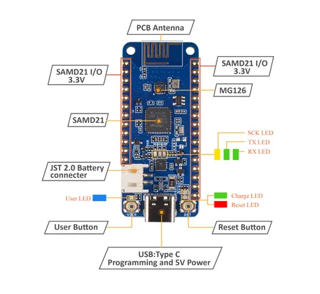

# Wio Lite MG126

**Seeed Studio** · Source collection

Revision: Unverified source identity  
Coverage: Source collection; review pending

[Browse all manufacturers](../../../../BROWSE.md) · [Desktop app](https://github.com/valleytechsolutions/black-wire-desktop)

## Hardware Overview

**source reference** · Unreviewed source · JPG

[Open original reference](../../../../library/media/cd541d3c19ef329ce1c5f8298c002794c8ba1cac754cce9b52ccfcc0ef6a1e77.jpg)

**Credit and rights:** Source rights not yet established. Source/manufacturer: Seeed Studio.

[Source 1](https://files.seeedstudio.com/wiki/Wio-Lite-MG126/img/Hardware-overview.jpg) · [Source 2](https://wiki.seeedstudio.com/Wio-Lite-MG126/)

Original source index: Hardware Overview. This file is searchable but has not been promoted to a reviewed physical board pinout.

SHA-256: `cd541d3c19ef329ce1c5f8298c002794c8ba1cac754cce9b52ccfcc0ef6a1e77`

Pin assignments have not been independently electrically verified. Check board revision before wiring.
