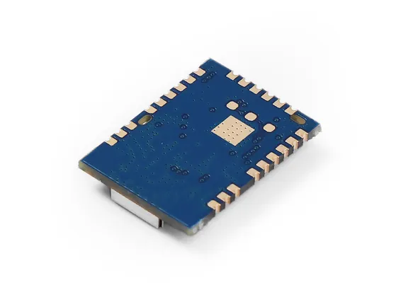
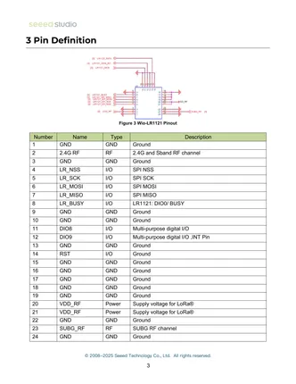

# Wio-LR1121

**Seeed Studio** · Source collection

Revision: Unverified source identity  
Coverage: Source collection; review pending

[Browse all manufacturers](../../../../BROWSE.md) · [Desktop app](https://github.com/valleytechsolutions/black-wire-desktop)

## Dimensions

**source reference** · Unreviewed source · JPG

[Open original reference](../../../../library/media/05f80eead3b81e83616ee724308908daf085bbb9183328b43372fa4e78f995ed.jpg)

**Credit and rights:** Source rights not yet established. Source/manufacturer: Seeed Studio.

[Source 1](https://media-cdn.seeedstudio.com/media/catalog/product/5/-/5-113991415-wio-lr1121_1.jpg) · [Source 2](https://www.seeedstudio.com/Wio-LR1121-with-IPEX-antenna-connector-p-6479.html)

Original source index: Dimensions. This file is searchable but has not been promoted to a reviewed physical board pinout.

SHA-256: `05f80eead3b81e83616ee724308908daf085bbb9183328b43372fa4e78f995ed`

## Pin Definition Table

**source reference** · Unreviewed source · PNG

[Open original reference](../../../../library/media/1c04ee28014ece9a4ccf16e7ff9d6060c9431119641d40d914f212c84796cd51.png)

**Credit and rights:** Source rights not yet established. Source/manufacturer: Seeed Studio.

[Source 1](https://files.seeedstudio.com/products/SenseCAP/Wio-LR1121/Wio-LR1121_Module_Datasheet.pdf) · [Source 2](https://www.seeedstudio.com/Wio-LR1121-with-IPEX-antenna-connector-p-6479.html)

Original source index: Pin Definition Table. This file is searchable but has not been promoted to a reviewed physical board pinout.

SHA-256: `1c04ee28014ece9a4ccf16e7ff9d6060c9431119641d40d914f212c84796cd51`

Pin assignments have not been independently electrically verified. Check board revision before wiring.
