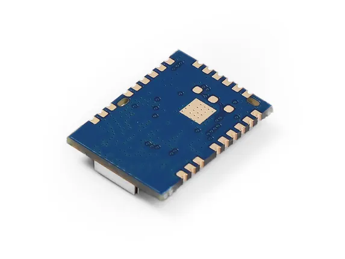
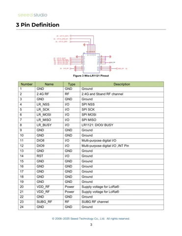

# Wio-LR1121

**Seeed Studio** · LR1121

Revision: Unverified source identity

Coverage: Supporting references; complete physical pinout still needed

[Browse all manufacturers](../../../../BROWSE.md) · [Devices & IoT](../../../../DEVICES.md) · [Open in the browser guide](https://valleytech-black-wire-guide.pages.dev/?board=source-board-46cc91e23ccadb5750)

## Datasheets and original documentation

Board datasheet: **recorded**. Visual reference: **available**.

[Original manufacturer / project documentation](https://www.seeedstudio.com/Wio-LR1121-with-IPEX-antenna-connector-p-6479.html)

- **datasheet / board**: [Wio-LR1121 module datasheet](https://files.seeedstudio.com/products/SenseCAP/Wio-LR1121/Wio-LR1121_Module_Datasheet.pdf) · [saved document](../../../../library/media/72b990d57d18058fc82378d570121c58878eaec5bb28fbfb640bde3c5e57cd50.pdf)

Source identity and visual scope reviewed. Pin assignments and electrical limits are not independently bench-verified. Match the exact PCB revision, connector view and populated options. The original datasheet distinguishes Wio-LR1121 with IPEX and Wio-LR1121-N with SMT RF pads. Saved pin table/schematic is not a complete physical module orientation drawing.

[Documentation coverage and remaining gaps](../../../../DOCUMENTATION.md)

## Dimensions

**source reference** · Unreviewed source · JPG

[Open original reference](../../../../library/media/05f80eead3b81e83616ee724308908daf085bbb9183328b43372fa4e78f995ed.jpg)

**Credit and rights:** Source rights not yet established. Source/manufacturer: Seeed Studio.

[Source 1](https://media-cdn.seeedstudio.com/media/catalog/product/5/-/5-113991415-wio-lr1121_1.jpg) · [Source 2](https://www.seeedstudio.com/Wio-LR1121-with-IPEX-antenna-connector-p-6479.html)

Original source index: Dimensions. This file is searchable but has not been promoted to a reviewed physical board pinout.

Image revision: Not identified

SHA-256: `05f80eead3b81e83616ee724308908daf085bbb9183328b43372fa4e78f995ed`

## Pin Definition Table

**source reference** · Unreviewed source · PNG

[Open original reference](../../../../library/media/1c04ee28014ece9a4ccf16e7ff9d6060c9431119641d40d914f212c84796cd51.png)

**Credit and rights:** Source rights not yet established. Source/manufacturer: Seeed Studio.

[Source 1](https://files.seeedstudio.com/products/SenseCAP/Wio-LR1121/Wio-LR1121_Module_Datasheet.pdf) · [Source 2](https://www.seeedstudio.com/Wio-LR1121-with-IPEX-antenna-connector-p-6479.html)

Original source index: Pin Definition Table. This file is searchable but has not been promoted to a reviewed physical board pinout.

Image revision: Not identified

SHA-256: `1c04ee28014ece9a4ccf16e7ff9d6060c9431119641d40d914f212c84796cd51`

## Wio-LR1121 module datasheet

**original reference PDF** · Source visual inspected; independent electrical and all-pin completeness review pending · PDF

[Open original reference](../../../../library/media/72b990d57d18058fc82378d570121c58878eaec5bb28fbfb640bde3c5e57cd50.pdf)

**Credit and rights:** Seeed Studio / original artwork contributors. Asset-specific redistribution and print rights are not established; Black Wire licenses do not relicense this source artwork.. Source/manufacturer: Seeed Studio.

[Source 1](https://files.seeedstudio.com/products/SenseCAP/Wio-LR1121/Wio-LR1121_Module_Datasheet.pdf) · [Source 2](https://www.seeedstudio.com/Wio-LR1121-with-IPEX-antenna-connector-p-6479.html)

Source identity and visual scope reviewed. Pin assignments and electrical limits are not independently bench-verified. Match the exact PCB revision, connector view and populated options. The original datasheet distinguishes Wio-LR1121 with IPEX and Wio-LR1121-N with SMT RF pads. Saved pin table/schematic is not a complete physical module orientation drawing.

Image revision: Unverified source identity

SHA-256: `72b990d57d18058fc82378d570121c58878eaec5bb28fbfb640bde3c5e57cd50`

## Wio-LR1121 — module signal table and schematic, datasheet page 5

**pin function reference** · Source visual inspected; independent electrical and all-pin completeness review pending · PNG

[Open original reference](../../../../library/media/c3841dd12c92229ee4b42de8736e8a64627ee298bb6bcfe2da008511205b3927.png)

**Credit and rights:** Seeed Studio / original artwork contributors. Asset-specific redistribution and print rights are not established; Black Wire licenses do not relicense this source artwork.. Source/manufacturer: Seeed Studio.

[Source 1](https://files.seeedstudio.com/products/SenseCAP/Wio-LR1121/Wio-LR1121_Module_Datasheet.pdf) · [Source 2](https://www.seeedstudio.com/Wio-LR1121-with-IPEX-antenna-connector-p-6479.html)

Source identity and visual scope reviewed. Pin assignments and electrical limits are not independently bench-verified. Match the exact PCB revision, connector view and populated options. The original datasheet distinguishes Wio-LR1121 with IPEX and Wio-LR1121-N with SMT RF pads. Saved pin table/schematic is not a complete physical module orientation drawing.

Image revision: Unverified source identity

SHA-256: `c3841dd12c92229ee4b42de8736e8a64627ee298bb6bcfe2da008511205b3927`

Pin assignments have not been independently electrically verified. Check board revision before wiring.
