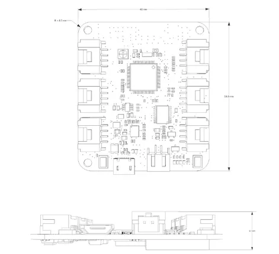
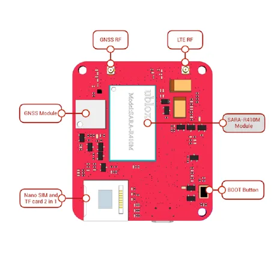
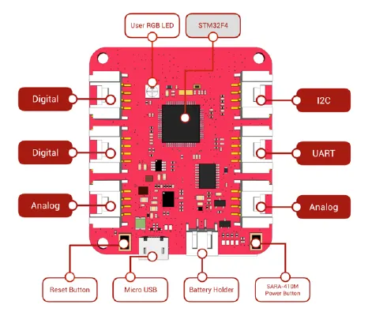

# Wio LTE Cat M1-NB-IoT Tracker

**Seeed Studio** · Source collection

Revision: Unverified source identity  
Coverage: Source collection; review pending

[Browse all manufacturers](../../../../BROWSE.md) · [Desktop app](https://github.com/valleytechsolutions/black-wire-desktop)

## Dimensions

**source reference** · Unreviewed source · PNG

[Open original reference](../../../../library/media/f4c97c5da168fafea74dbd5163f27c7bb305b1427216b248b8990457bad37300.png)

**Credit and rights:** Source rights not yet established. Source/manufacturer: Seeed Studio.

[Source 1](https://files.seeedstudio.com/wiki/Wio_LTE_Cat_M1_NB-IoT_Tracker/img/h3.png) · [Source 2](https://wiki.seeedstudio.com/Wio_LTE_Cat_M1_NB-IoT_Tracker/)

Original source index: Dimensions. This file is searchable but has not been promoted to a reviewed physical board pinout.

SHA-256: `f4c97c5da168fafea74dbd5163f27c7bb305b1427216b248b8990457bad37300`

## Hardware Overview (Back)

**source reference** · Unreviewed source · PNG

[Open original reference](../../../../library/media/0ae4fab6d569a121aa455f04367026b15e91012877d05846d57a58dac6c4aad5.png)

**Credit and rights:** Source rights not yet established. Source/manufacturer: Seeed Studio.

[Source 1](https://files.seeedstudio.com/wiki/Wio_LTE_Cat_M1_NB-IoT_Tracker/img/back.png) · [Source 2](https://wiki.seeedstudio.com/Wio_LTE_Cat_M1_NB-IoT_Tracker/)

Original source index: Hardware Overview (Back). This file is searchable but has not been promoted to a reviewed physical board pinout.

SHA-256: `0ae4fab6d569a121aa455f04367026b15e91012877d05846d57a58dac6c4aad5`

## Hardware Overview (Front)

**source reference** · Unreviewed source · PNG

[Open original reference](../../../../library/media/23353d6d3be73b61f4588c375bd8c68e24c652867589104e96cf521929fecc4e.png)

**Credit and rights:** Source rights not yet established. Source/manufacturer: Seeed Studio.

[Source 1](https://files.seeedstudio.com/wiki/Wio_LTE_Cat_M1_NB-IoT_Tracker/img/front.png) · [Source 2](https://wiki.seeedstudio.com/Wio_LTE_Cat_M1_NB-IoT_Tracker/)

Original source index: Hardware Overview (Front). This file is searchable but has not been promoted to a reviewed physical board pinout.

SHA-256: `23353d6d3be73b61f4588c375bd8c68e24c652867589104e96cf521929fecc4e`

Pin assignments have not been independently electrically verified. Check board revision before wiring.
