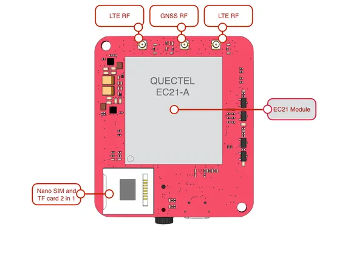
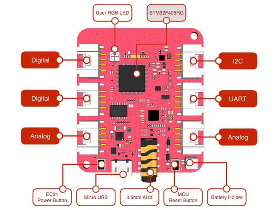

# Wio LTE Cat.1

**Seeed Studio** · Source collection

Revision: Unverified source identity  
Coverage: Source collection; review pending

[Browse all manufacturers](../../../../BROWSE.md) · [Desktop app](https://github.com/valleytechsolutions/black-wire-desktop)

## Hardware Overview (Bottom)

**source reference** · Unreviewed source · PNG

[Open original reference](../../../../library/media/d45a66b536bc97705a1a7a7852b1858df2cd917da0fa80172d4396d5bf209e28.png)

**Credit and rights:** Source rights not yet established. Source/manufacturer: Seeed Studio.

[Source 1](https://files.seeedstudio.com/wiki/Wio_LTE/img/wio_tracker_lte_v1_buttom.png) · [Source 2](https://wiki.seeedstudio.com/Wio_LTE_Cat.1/)

Original source index: Hardware Overview (Bottom). This file is searchable but has not been promoted to a reviewed physical board pinout.

SHA-256: `d45a66b536bc97705a1a7a7852b1858df2cd917da0fa80172d4396d5bf209e28`

## Hardware Overview (Top)

**source reference** · Unreviewed source · PNG

[Open original reference](../../../../library/media/614f2a20b3e6ff74bf31a011f8718032e1b9aca8947e87704fb73a4b42362665.png)

**Credit and rights:** Source rights not yet established. Source/manufacturer: Seeed Studio.

[Source 1](https://files.seeedstudio.com/wiki/Wio_LTE/img/wio_tracker_lte_v1._top.png) · [Source 2](https://wiki.seeedstudio.com/Wio_LTE_Cat.1/)

Original source index: Hardware Overview (Top). This file is searchable but has not been promoted to a reviewed physical board pinout.

SHA-256: `614f2a20b3e6ff74bf31a011f8718032e1b9aca8947e87704fb73a4b42362665`

Pin assignments have not been independently electrically verified. Check board revision before wiring.
