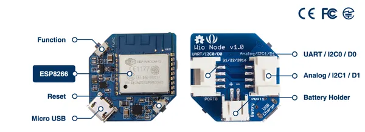

# Wio Node

**Seeed Studio** · Source collection

Revision: Unverified source identity  
Coverage: Source collection; review pending

[Browse all manufacturers](../../../../BROWSE.md) · [Desktop app](https://github.com/valleytechsolutions/black-wire-desktop)

## Hardware Overview

**source reference** · Unreviewed source · JPG

[Open original reference](../../../../library/media/d0c8e4fc2367921a91b90d701aee331e54adc39ce4fd0be2b466bc6d24f8acbc.jpg)

**Credit and rights:** Source rights not yet established. Source/manufacturer: Seeed Studio.

[Source 1](https://files.seeedstudio.com/wiki/Wio_Node/pictures/Wio_Node_illustrate.jpg) · [Source 2](https://wiki.seeedstudio.com/Wio_Node/)

Original source index: Hardware Overview. This file is searchable but has not been promoted to a reviewed physical board pinout.

SHA-256: `d0c8e4fc2367921a91b90d701aee331e54adc39ce4fd0be2b466bc6d24f8acbc`

Pin assignments have not been independently electrically verified. Check board revision before wiring.
