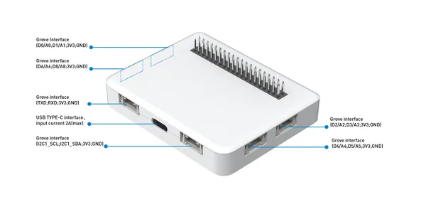
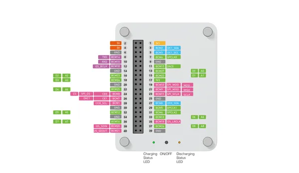

# Wio Terminal Chassis - Battery (650mAh)

**Seeed Studio** · Source collection

Revision: Unverified source identity  
Coverage: Source collection; review pending

[Browse all manufacturers](../../../../BROWSE.md) · [Devices & IoT](../../../../DEVICES.md) · [Open in the browser guide](https://valleytech-black-wire-guide.pages.dev/?board=source-board-51eb849298243e37e1)

Device category: **Displays & HMI**

## Battery (650mAh) - Hardware Overview

**source reference** · Unreviewed source · JPG

[Open original reference](../../../../library/media/40a235a3271267ce4d72f08f422cc786a46d960889ef444c7c0c95a813e5b8a4.jpg)

**Credit and rights:** Source rights not yet established. Source/manufacturer: Seeed Studio.

[Source 1](https://files.seeedstudio.com/wiki/Wio-Terminal-Battery-Chassis/img/WT-battery-front.jpg) · [Source 2](https://wiki.seeedstudio.com/Wio-Terminal-Chassis-Battery_650mAh/)

Original source index: Battery (650mAh) - Hardware Overview. This file is searchable but has not been promoted to a reviewed physical board pinout.

Image revision: Not identified

SHA-256: `40a235a3271267ce4d72f08f422cc786a46d960889ef444c7c0c95a813e5b8a4`

## Battery (650mAh) - Pinout

**source reference** · Unreviewed source · PNG

[Open original reference](../../../../library/media/794907b18c15ef4815a27db7947ca568ab7981011407d9aaabd44862eb48608f.png)

**Credit and rights:** Source rights not yet established. Source/manufacturer: Seeed Studio.

[Source 1](https://files.seeedstudio.com/wiki/Wio-Terminal-Battery-Chassis/img/new-pin.png) · [Source 2](https://wiki.seeedstudio.com/Wio-Terminal-Chassis-Battery_650mAh/)

Original source index: Battery (650mAh) - Pinout. This file is searchable but has not been promoted to a reviewed physical board pinout.

Image revision: Not identified

SHA-256: `794907b18c15ef4815a27db7947ca568ab7981011407d9aaabd44862eb48608f`

Pin assignments have not been independently electrically verified. Check board revision before wiring.
