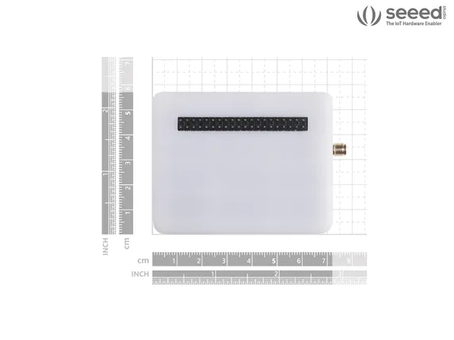

# Wio Terminal LoRaWAN Chassis with Antenna-built-in LoRa-E5 and GNSS

**Seeed Studio** · Source collection

Revision: Unverified source identity  
Coverage: Source collection; review pending

[Browse all manufacturers](../../../../BROWSE.md) · [Devices & IoT](../../../../DEVICES.md) · [Open in the browser guide](https://valleytech-black-wire-guide.pages.dev/?board=source-board-e480465de04274a647)

Device category: **Radios & GNSS**

## Dimensions

**source reference** · Unreviewed source · PNG

[Open original reference](../../../../library/media/f85b408fc3dee3e75511fadd26d8d92af14fb06aff9fea2db1df5132c9097420.png)

**Credit and rights:** Source rights not yet established. Source/manufacturer: Seeed Studio.

[Source 1](https://files.seeedstudio.com/wiki/LoRa_WioTerminal/img/114992728_Size-08.png) · [Source 2](https://wiki.seeedstudio.com/Wio_Terminal_LoRaWan_Chassis_with_Antenna-built-in_LoRa-E5_and_GNSS_EU868_US915/)

Original source index: Dimensions. This file is searchable but has not been promoted to a reviewed physical board pinout.

Image revision: Not identified

SHA-256: `f85b408fc3dee3e75511fadd26d8d92af14fb06aff9fea2db1df5132c9097420`

Pin assignments have not been independently electrically verified. Check board revision before wiring.
