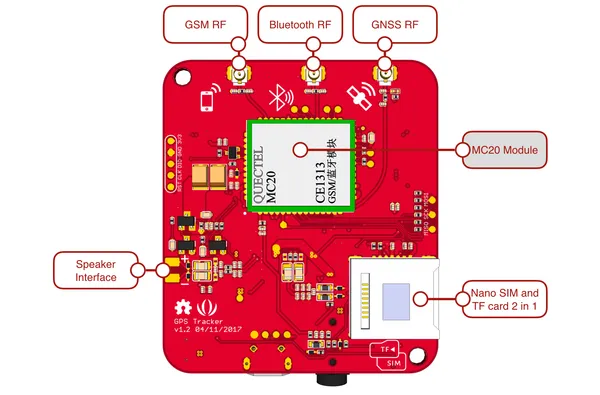
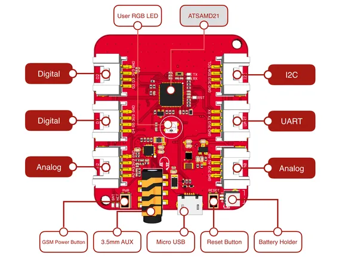

# Wio Tracker - GPS, BT3.0, GSM

**Seeed Studio** · Source collection

Revision: Unverified source identity  
Coverage: Source collection; review pending

[Browse all manufacturers](../../../../BROWSE.md) · [Devices & IoT](../../../../DEVICES.md) · [Open in the browser guide](https://valleytech-black-wire-guide.pages.dev/?board=source-board-37f9bdc8a14fc66753)

Device category: **Radios & GNSS**

## GPS, BT3.0, GSM - Hardware Overview (Bottom)

**source reference** · Unreviewed source · PNG

[Open original reference](../../../../library/media/f42413775d5afb0c5351f4e96a4e791818cb4c67c1e2875548cbe9fda4ead45c.png)

**Credit and rights:** Source rights not yet established. Source/manufacturer: Seeed Studio.

[Source 1](https://files.seeedstudio.com/wiki/GPS_Tracker/images/GPS_Tracker_v1.2_bottom.png) · [Source 2](https://wiki.seeedstudio.com/wio_gps_board/)

Original source index: GPS, BT3.0, GSM - Hardware Overview (Bottom). This file is searchable but has not been promoted to a reviewed physical board pinout.

Image revision: Not identified

SHA-256: `f42413775d5afb0c5351f4e96a4e791818cb4c67c1e2875548cbe9fda4ead45c`

## GPS, BT3.0, GSM - Hardware Overview (Top)

**source reference** · Unreviewed source · PNG

[Open original reference](../../../../library/media/a7cdf028dbf4c86e389ac6723f409571fd14d9587082ff38574aa6a5818988e5.png)

**Credit and rights:** Source rights not yet established. Source/manufacturer: Seeed Studio.

[Source 1](https://files.seeedstudio.com/wiki/GPS_Tracker/images/GPS_Tracker_v1.2_top.png) · [Source 2](https://wiki.seeedstudio.com/wio_gps_board/)

Original source index: GPS, BT3.0, GSM - Hardware Overview (Top). This file is searchable but has not been promoted to a reviewed physical board pinout.

Image revision: Not identified

SHA-256: `a7cdf028dbf4c86e389ac6723f409571fd14d9587082ff38574aa6a5818988e5`

Pin assignments have not been independently electrically verified. Check board revision before wiring.
