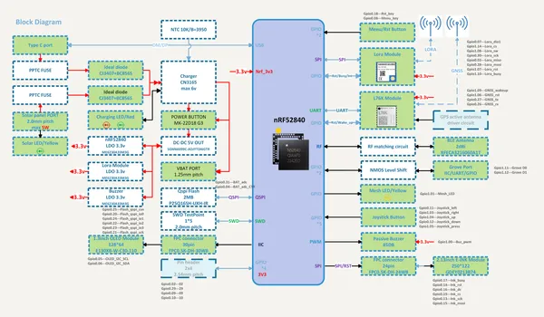
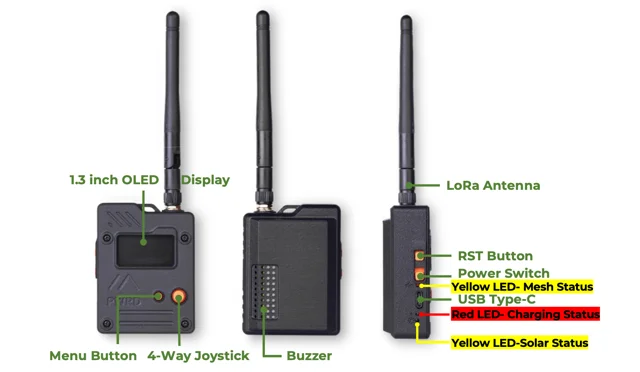
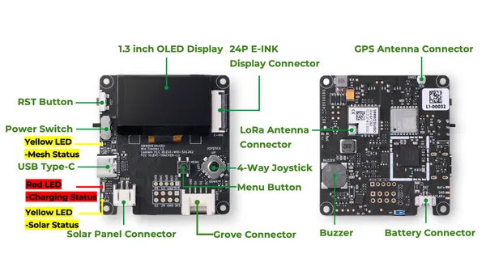

# Wio Tracker L1

**Seeed Studio** · nRF52840

Revision: Unverified source identity

Coverage: Supporting references; complete physical pinout still needed

[Browse all manufacturers](../../../../BROWSE.md) · [Devices & IoT](../../../../DEVICES.md) · [Open in the browser guide](https://valleytech-black-wire-guide.pages.dev/?board=source-board-7f5c6549cf76f5e412)

Device category: **Radios & GNSS**

Source identity and visual scope reviewed. Pin assignments and electrical limits are not independently bench-verified. Match the exact PCB revision, connector view and populated options. The L1 series overview contains several variants. A component overview or block diagram is not a complete GPIO map; match OLED, E-Ink, Lite and Pro hardware separately.

## Datasheets and original documentation

Board datasheet: **not yet recorded**. Visual reference: **available**.

[Original manufacturer / project documentation](https://wiki.seeedstudio.com/wio_tracker_l1_node/)

- **hardware-guide / board**: [L1 series hardware overview and specifications](https://wiki.seeedstudio.com/wio_tracker_l1_node/) · online

Source identity and visual scope reviewed. Pin assignments and electrical limits are not independently bench-verified. Match the exact PCB revision, connector view and populated options. The L1 series overview contains several variants. A component overview or block diagram is not a complete GPIO map; match OLED, E-Ink, Lite and Pro hardware separately.

[Documentation coverage and remaining gaps](../../../../DOCUMENTATION.md)

## Block Diagram

**block diagram** · Series block diagram inspected; not a physical GPIO map · PNG

[Open original reference](../../../../library/media/c3adf319a52fe4e742036a29f7ea49d553e51335397a4778b4e15e107e9b9814.png)

**Credit and rights:** Source rights not yet established. Source/manufacturer: Seeed Studio.

[Source 1](https://files.seeedstudio.com/wiki/SenseCAP/wio_tracker/L1%20Diagram.png) · [Source 2](https://wiki.seeedstudio.com/wio_tracker_l1_node/)

Original source index: Block Diagram. This file is searchable but has not been promoted to a reviewed physical board pinout.

Image revision: Not identified

SHA-256: `c3adf319a52fe4e742036a29f7ea49d553e51335397a4778b4e15e107e9b9814`

## Hardware Overview (Enclosure)

**board labeling image** · Series component labels inspected; not a complete physical pinout · PNG

[Open original reference](../../../../library/media/cf10d864e2a0f3a6fdf74a2f0dd0957de5e61f2c305bd7e1934f65ea7b8ae04b.png)

**Credit and rights:** Source rights not yet established. Source/manufacturer: Seeed Studio.

[Source 1](https://files.seeedstudio.com/wiki/SenseCAP/Meshtastic/wio_tracker_l1-pro.png) · [Source 2](https://wiki.seeedstudio.com/wio_tracker_l1_node/)

Original source index: Hardware Overview (Enclosure). This file is searchable but has not been promoted to a reviewed physical board pinout.

Image revision: Not identified

SHA-256: `cf10d864e2a0f3a6fdf74a2f0dd0957de5e61f2c305bd7e1934f65ea7b8ae04b`

## Hardware Overview

**board labeling image** · Series component labels inspected; not a complete physical pinout · PNG

[Open original reference](../../../../library/media/30cc5cadc20697333afdf18a2309b2acec11f7ea02bde40d05cb7fababe8edaf.png)

**Credit and rights:** Source rights not yet established. Source/manufacturer: Seeed Studio.

[Source 1](https://files.seeedstudio.com/wiki/SenseCAP/Meshtastic/wio_tracker-l1.png) · [Source 2](https://wiki.seeedstudio.com/wio_tracker_l1_node/)

Original source index: Hardware Overview. This file is searchable but has not been promoted to a reviewed physical board pinout.

Image revision: Not identified

SHA-256: `30cc5cadc20697333afdf18a2309b2acec11f7ea02bde40d05cb7fababe8edaf`

Pin assignments have not been independently electrically verified. Check board revision before wiring.
