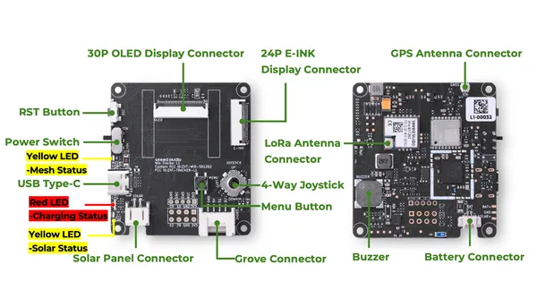

# Wio Tracker L1 E-Ink

**Seeed Studio** · Source collection

Revision: Unverified source identity  
Coverage: Source collection; review pending

[Browse all manufacturers](../../../../BROWSE.md) · [Desktop app](https://github.com/valleytechsolutions/black-wire-desktop)

## Hardware Overview

**source reference** · Unreviewed source · PNG

[Open original reference](../../../../library/media/8c5eb0719a1e9d0101f10dd3ddc8620b5b0c2dddb00bebe99d1b25324acf5a6e.png)

**Credit and rights:** Source rights not yet established. Source/manufacturer: Seeed Studio.

[Source 1](https://files.seeedstudio.com/wiki/SenseCAP/Meshtastic/wio_tracker_l1_lite.png) · [Source 2](https://wiki.seeedstudio.com/wio_tracker_l1_node/)

Original source index: Hardware Overview. This file is searchable but has not been promoted to a reviewed physical board pinout.

SHA-256: `8c5eb0719a1e9d0101f10dd3ddc8620b5b0c2dddb00bebe99d1b25324acf5a6e`

Pin assignments have not been independently electrically verified. Check board revision before wiring.
