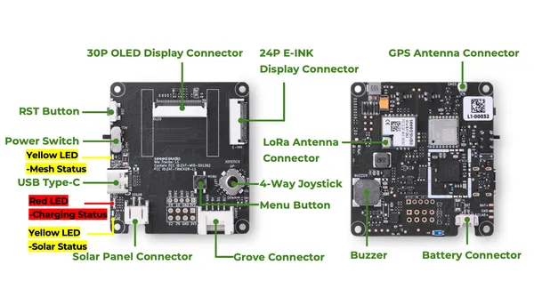

# Wio Tracker L1 E-Ink

**Seeed Studio** · nRF52840

Revision: Unverified source identity

Coverage: Supporting references; complete physical pinout still needed

[Browse all manufacturers](../../../../BROWSE.md) · [Devices & IoT](../../../../DEVICES.md) · [Open in the browser guide](https://valleytech-black-wire-guide.pages.dev/?board=source-board-976577678dfc4cebe8)

Device category: **Radios & GNSS**

Source identity and visual scope reviewed. Pin assignments and electrical limits are not independently bench-verified. Match the exact PCB revision, connector view and populated options. The L1 series overview contains several variants. A component overview or block diagram is not a complete GPIO map; match OLED, E-Ink, Lite and Pro hardware separately.

## Datasheets and original documentation

Board datasheet: **not yet recorded**. Visual reference: **available**.

[Original manufacturer / project documentation](https://wiki.seeedstudio.com/wio_tracker_l1_node/)

- **hardware-guide / board**: [L1 series hardware overview and specifications](https://wiki.seeedstudio.com/wio_tracker_l1_node/) · online

Source identity and visual scope reviewed. Pin assignments and electrical limits are not independently bench-verified. Match the exact PCB revision, connector view and populated options. The L1 series overview contains several variants. A component overview or block diagram is not a complete GPIO map; match OLED, E-Ink, Lite and Pro hardware separately.

[Documentation coverage and remaining gaps](../../../../DOCUMENTATION.md)

## Hardware Overview

**board labeling image** · Series component labels inspected; not a complete physical pinout · PNG

[Open original reference](../../../../library/media/8c5eb0719a1e9d0101f10dd3ddc8620b5b0c2dddb00bebe99d1b25324acf5a6e.png)

**Credit and rights:** Source rights not yet established. Source/manufacturer: Seeed Studio.

[Source 1](https://files.seeedstudio.com/wiki/SenseCAP/Meshtastic/wio_tracker_l1_lite.png) · [Source 2](https://wiki.seeedstudio.com/wio_tracker_l1_node/)

Original source index: Hardware Overview. This file is searchable but has not been promoted to a reviewed physical board pinout.

Image revision: Not identified

SHA-256: `8c5eb0719a1e9d0101f10dd3ddc8620b5b0c2dddb00bebe99d1b25324acf5a6e`

Pin assignments have not been independently electrically verified. Check board revision before wiring.
