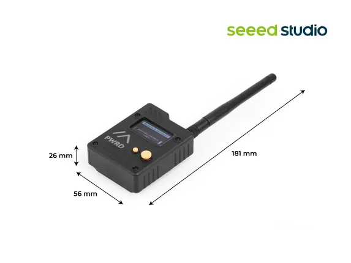

# Wio Tracker L1 Pro

**Seeed Studio** · Source collection

Revision: Unverified source identity  
Coverage: Source collection; review pending

[Browse all manufacturers](../../../../BROWSE.md) · [Devices & IoT](../../../../DEVICES.md) · [Open in the browser guide](https://valleytech-black-wire-guide.pages.dev/?board=source-board-73106bbb60db7faf8b)

Device category: **Radios & GNSS**

## Dimensions

**source reference** · Unreviewed source · JPG

[Open original reference](../../../../library/media/f7067219bc981d455be4c1a667ef3b6ceb6df5caa0353c90d5d4bede9e1a5591.jpg)

**Credit and rights:** Source rights not yet established. Source/manufacturer: Seeed Studio.

[Source 1](https://media-cdn.seeedstudio.com/media/catalog/product/8/-/8-114993649-wio-tracker-l1-pro8.jpg) · [Source 2](https://www.seeedstudio.com/Wio-Tracker-L1-Pro-p-6454.html)

Original source index: Dimensions. This file is searchable but has not been promoted to a reviewed physical board pinout.

Image revision: Not identified

SHA-256: `f7067219bc981d455be4c1a667ef3b6ceb6df5caa0353c90d5d4bede9e1a5591`

Pin assignments have not been independently electrically verified. Check board revision before wiring.
