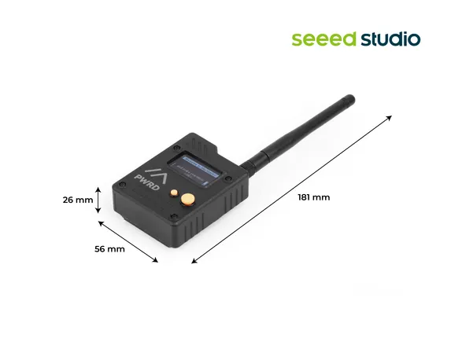

# Wio Tracker L1 Pro

**Seeed Studio** · nRF52840

Revision: Unverified source identity

Coverage: Supporting references; complete physical pinout still needed

[Browse all manufacturers](../../../../BROWSE.md) · [Devices & IoT](../../../../DEVICES.md) · [Open in the browser guide](https://valleytech-black-wire-guide.pages.dev/?board=source-board-73106bbb60db7faf8b)

Device category: **Radios & GNSS**

Source identity and visual scope reviewed. Pin assignments and electrical limits are not independently bench-verified. Match the exact PCB revision, connector view and populated options. The L1 series overview contains several variants. A component overview or block diagram is not a complete GPIO map; match OLED, E-Ink, Lite and Pro hardware separately.

## Datasheets and original documentation

Board datasheet: **not yet recorded**. Visual reference: **available**.

[Original manufacturer / project documentation](https://wiki.seeedstudio.com/wio_tracker_l1_node/)

- **hardware-guide / board**: [L1 series hardware overview and specifications](https://wiki.seeedstudio.com/wio_tracker_l1_node/) · online

Source identity and visual scope reviewed. Pin assignments and electrical limits are not independently bench-verified. Match the exact PCB revision, connector view and populated options. The L1 series overview contains several variants. A component overview or block diagram is not a complete GPIO map; match OLED, E-Ink, Lite and Pro hardware separately.

[Documentation coverage and remaining gaps](../../../../DOCUMENTATION.md)

## Dimensions

**source reference** · Unreviewed source · JPG

[Open original reference](../../../../library/media/f7067219bc981d455be4c1a667ef3b6ceb6df5caa0353c90d5d4bede9e1a5591.jpg)

**Credit and rights:** Source rights not yet established. Source/manufacturer: Seeed Studio.

[Source 1](https://media-cdn.seeedstudio.com/media/catalog/product/8/-/8-114993649-wio-tracker-l1-pro8.jpg) · [Source 2](https://www.seeedstudio.com/Wio-Tracker-L1-Pro-p-6454.html)

Original source index: Dimensions. This file is searchable but has not been promoted to a reviewed physical board pinout.

Image revision: Not identified

SHA-256: `f7067219bc981d455be4c1a667ef3b6ceb6df5caa0353c90d5d4bede9e1a5591`

## Wio Tracker L1 Pro — enclosure components (not a GPIO map)

**board labeling image** · Source visual inspected; independent electrical and all-pin completeness review pending · PNG

[Open original reference](../../../../library/media/cf10d864e2a0f3a6fdf74a2f0dd0957de5e61f2c305bd7e1934f65ea7b8ae04b.png)

**Credit and rights:** Seeed Studio / original artwork contributors. Asset-specific redistribution and print rights are not established; Black Wire licenses do not relicense this source artwork.. Source/manufacturer: Seeed Studio.

[Source 1](https://files.seeedstudio.com/wiki/SenseCAP/Meshtastic/wio_tracker_l1-pro.png) · [Source 2](https://wiki.seeedstudio.com/wio_tracker_l1_node/)

Source identity and visual scope reviewed. Pin assignments and electrical limits are not independently bench-verified. Match the exact PCB revision, connector view and populated options. The L1 series overview contains several variants. A component overview or block diagram is not a complete GPIO map; match OLED, E-Ink, Lite and Pro hardware separately.

Image revision: Unverified source identity

SHA-256: `cf10d864e2a0f3a6fdf74a2f0dd0957de5e61f2c305bd7e1934f65ea7b8ae04b`

Pin assignments have not been independently electrically verified. Check board revision before wiring.
