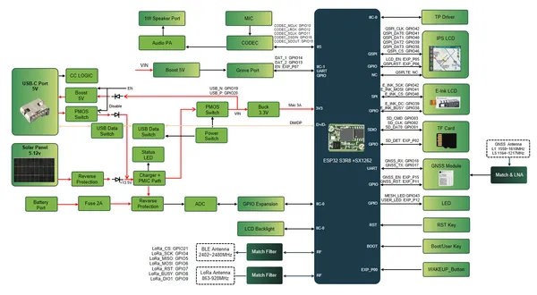
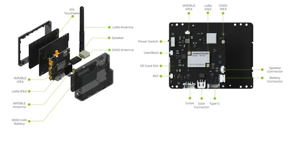
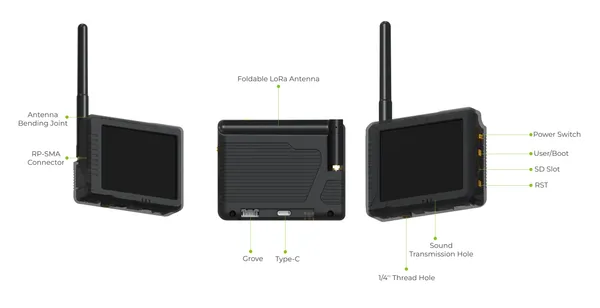

# Wio Tracker L2

**Seeed Studio** · Source collection

Revision: Unverified source identity  
Coverage: Source collection; review pending

[Browse all manufacturers](../../../../BROWSE.md) · [Devices & IoT](../../../../DEVICES.md) · [Open in the browser guide](https://valleytech-black-wire-guide.pages.dev/?board=source-board-0cb846db3217a93759)

Device category: **Radios & GNSS**

## Block Diagram

**source reference** · Unreviewed source · PNG

[Open original reference](../../../../library/media/1dd06c0272207f5ec4705e237f5a5f0851c8682333c4aefd7c04fceac579c17c.png)

**Credit and rights:** Source rights not yet established. Source/manufacturer: Seeed Studio.

[Source 1](https://files.seeedstudio.com/wiki/SenseCAP/Wio_Tracker_L2/SchematicDiagram9.7(1).png) · [Source 2](https://wiki.seeedstudio.com/meshtastic_wio_tracker_l2_intro/)

Original source index: Block Diagram. This file is searchable but has not been promoted to a reviewed physical board pinout.

Image revision: Not identified

SHA-256: `1dd06c0272207f5ec4705e237f5a5f0851c8682333c4aefd7c04fceac579c17c`

## Hardware Overview (Inside)

**source reference** · Unreviewed source · PNG

[Open original reference](../../../../library/media/ae2c32800c1f540977d74f962ab19165ecc62686912b4e06c0e71257dcbc1241.png)

**Credit and rights:** Source rights not yet established. Source/manufacturer: Seeed Studio.

[Source 1](https://files.seeedstudio.com/wiki/SenseCAP/Wio_Tracker_L2/L2DeviceComponent9.7(1).png) · [Source 2](https://wiki.seeedstudio.com/meshtastic_wio_tracker_l2_intro/)

Original source index: Hardware Overview (Inside). This file is searchable but has not been promoted to a reviewed physical board pinout.

Image revision: Not identified

SHA-256: `ae2c32800c1f540977d74f962ab19165ecc62686912b4e06c0e71257dcbc1241`

## Hardware Overview 2

**source reference** · Unreviewed source · PNG

[Open original reference](../../../../library/media/c01e9f546a26e7584ea8483975dfe511c2240388f45f89a076571aa01c8ff1be.png)

**Credit and rights:** Source rights not yet established. Source/manufacturer: Seeed Studio.

[Source 1](https://files.seeedstudio.com/wiki/SenseCAP/Wio_Tracker_L2/L2DeviceComponent29.7(2).png) · [Source 2](https://wiki.seeedstudio.com/meshtastic_wio_tracker_l2_intro/)

Original source index: Hardware Overview 2. This file is searchable but has not been promoted to a reviewed physical board pinout.

Image revision: Not identified

SHA-256: `c01e9f546a26e7584ea8483975dfe511c2240388f45f89a076571aa01c8ff1be`

Pin assignments have not been independently electrically verified. Check board revision before wiring.
