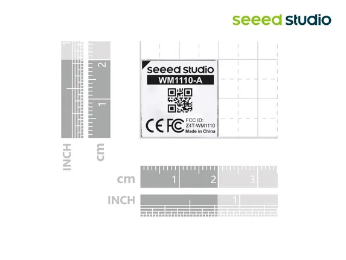

# Wio-WM1110 Module

**Seeed Studio** · Source collection

Revision: Unverified source identity  
Coverage: Source collection; review pending

[Browse all manufacturers](../../../../BROWSE.md) · [Desktop app](https://github.com/valleytechsolutions/black-wire-desktop)

## Dimensions

**source reference** · Unreviewed source · JPG

[Open original reference](../../../../library/media/9590db6928d25b4d436755a1b659e9f93a3bc2caeb42af0e4b69fd4d30ebbf43.jpg)

**Credit and rights:** Source rights not yet established. Source/manufacturer: Seeed Studio.

[Source 1](https://media-cdn.seeedstudio.com/media/catalog/product/5/-/5-327133202-wm1110-a-size3.1.jpg) · [Source 2](https://www.seeedstudio.com/Wio-WM1110-Module-LR1110-and-nRF52840-p-5676.html)

Original source index: Dimensions. This file is searchable but has not been promoted to a reviewed physical board pinout.

SHA-256: `9590db6928d25b4d436755a1b659e9f93a3bc2caeb42af0e4b69fd4d30ebbf43`

Pin assignments have not been independently electrically verified. Check board revision before wiring.
