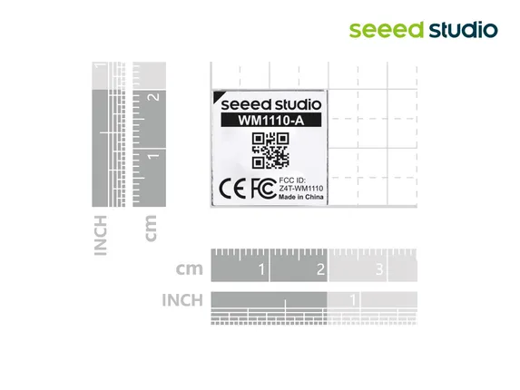

# Wio-WM1110 Module

**Seeed Studio** · Source collection

Revision: Unverified source identity

Coverage: Source collection; review pending

[Browse all manufacturers](../../../../BROWSE.md) · [Devices & IoT](../../../../DEVICES.md) · [Open in the browser guide](https://valleytech-black-wire-guide.pages.dev/?board=source-board-bea007a7950ac7b820)

## Datasheets and original documentation

Board datasheet: **not yet recorded**. Visual reference: **available**.

[Manufacturer source (recorded link)](https://www.seeedstudio.com/Wio-WM1110-Module-LR1110-and-nRF52840-p-5676.html)

A chip datasheet, schematic and board datasheet have different scopes. Match the exact hardware revision.

[Documentation coverage and remaining gaps](../../../../DOCUMENTATION.md)

## Dimensions

**source reference** · Unreviewed source · JPG

[Open original reference](../../../../library/media/9590db6928d25b4d436755a1b659e9f93a3bc2caeb42af0e4b69fd4d30ebbf43.jpg)

**Credit and rights:** Source rights not yet established. Source/manufacturer: Seeed Studio.

[Source 1](https://media-cdn.seeedstudio.com/media/catalog/product/5/-/5-327133202-wm1110-a-size3.1.jpg) · [Source 2](https://www.seeedstudio.com/Wio-WM1110-Module-LR1110-and-nRF52840-p-5676.html)

Original source index: Dimensions. This file is searchable but has not been promoted to a reviewed physical board pinout.

Image revision: Not identified

SHA-256: `9590db6928d25b4d436755a1b659e9f93a3bc2caeb42af0e4b69fd4d30ebbf43`

Pin assignments have not been independently electrically verified. Check board revision before wiring.
