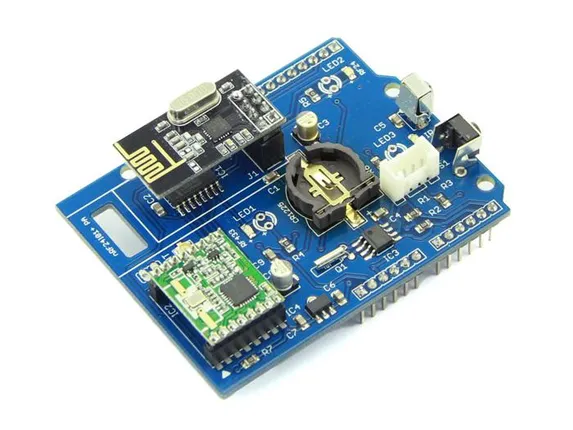

# Wireless Gate Shield V1.0

**Seeed Studio** · Source collection

Revision: Unverified source identity  
Coverage: Source collection; review pending

[Browse all manufacturers](../../../../BROWSE.md) · [Desktop app](https://github.com/valleytechsolutions/black-wire-desktop)

## Hardware Overview (Front)

**source reference** · Unreviewed source · JPG

[Open original reference](../../../../library/media/d14bf70e619d1e78d8873997a613320f4836d54fd64ef565af5465b19a56a0bd.jpg)

**Credit and rights:** Source rights not yet established. Source/manufacturer: Seeed Studio.

[Source 1](https://files.seeedstudio.com/wiki/WireLess_Gate_Shield_V1.0/img/WLG_h.jpg) · [Source 2](https://wiki.seeedstudio.com/WireLess_Gate_Shield_V1.0/)

Original source index: Hardware Overview (Front). This file is searchable but has not been promoted to a reviewed physical board pinout.

SHA-256: `d14bf70e619d1e78d8873997a613320f4836d54fd64ef565af5465b19a56a0bd`

Pin assignments have not been independently electrically verified. Check board revision before wiring.
