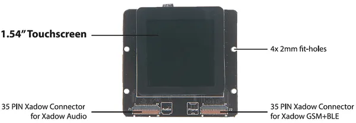

# Xadow - 1.54 inch Touchscreen

**Seeed Studio** · Source collection

Revision: Unverified source identity  
Coverage: Source collection; review pending

[Browse all manufacturers](../../../../BROWSE.md) · [Desktop app](https://github.com/valleytechsolutions/black-wire-desktop)

## 1.54 inch Touchscreen - Hardware Overview

**source reference** · Unreviewed source · PNG

[Open original reference](../../../../library/media/674f317f793cad69b25c8638c4258a3e9ac060b3c59e75b4ee140f2039439874.png)

**Credit and rights:** Source rights not yet established. Source/manufacturer: Seeed Studio.

[Source 1](https://files.seeedstudio.com/wiki/Xadow_1.54_Inch_Touchscreen/images/Xadow_1.54%E2%80%99%E2%80%99_Touchscreen.png) · [Source 2](https://wiki.seeedstudio.com/Xadow_1.54_inch_Touchscreen/)

Original source index: 1.54 inch Touchscreen - Hardware Overview. This file is searchable but has not been promoted to a reviewed physical board pinout.

SHA-256: `674f317f793cad69b25c8638c4258a3e9ac060b3c59e75b4ee140f2039439874`

Pin assignments have not been independently electrically verified. Check board revision before wiring.
