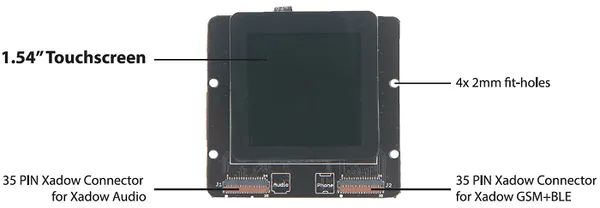

# Xadow - 1.54 inch Touchscreen

**Seeed Studio** · Source collection

Revision: Unverified source identity

Coverage: Source collection; review pending

[Browse all manufacturers](../../../../BROWSE.md) · [Devices & IoT](../../../../DEVICES.md) · [Open in the browser guide](https://valleytech-black-wire-guide.pages.dev/?board=source-board-9741860a7ed890420c)

## Datasheets and original documentation

Board datasheet: **not yet recorded**. Visual reference: **available**.

[Manufacturer source (recorded link)](https://wiki.seeedstudio.com/Xadow_1.54_inch_Touchscreen/)

A chip datasheet, schematic and board datasheet have different scopes. Match the exact hardware revision.

[Documentation coverage and remaining gaps](../../../../DOCUMENTATION.md)

## 1.54 inch Touchscreen - Hardware Overview

**source reference** · Unreviewed source · PNG

[Open original reference](../../../../library/media/674f317f793cad69b25c8638c4258a3e9ac060b3c59e75b4ee140f2039439874.png)

**Credit and rights:** Source rights not yet established. Source/manufacturer: Seeed Studio.

[Source 1](https://files.seeedstudio.com/wiki/Xadow_1.54_Inch_Touchscreen/images/Xadow_1.54%E2%80%99%E2%80%99_Touchscreen.png) · [Source 2](https://wiki.seeedstudio.com/Xadow_1.54_inch_Touchscreen/)

Original source index: 1.54 inch Touchscreen - Hardware Overview. This file is searchable but has not been promoted to a reviewed physical board pinout.

Image revision: Not identified

SHA-256: `674f317f793cad69b25c8638c4258a3e9ac060b3c59e75b4ee140f2039439874`

Pin assignments have not been independently electrically verified. Check board revision before wiring.
