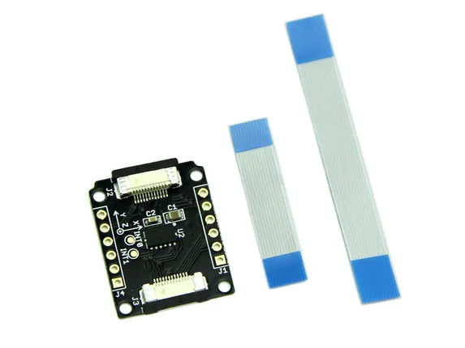

# Xadow - 3-Axis Accelerometer

**Seeed Studio** · Source collection

Revision: Unverified source identity  
Coverage: Source collection; review pending

[Browse all manufacturers](../../../../BROWSE.md) · [Desktop app](https://github.com/valleytechsolutions/black-wire-desktop)

## 3-Axis Accelerometer - Hardware Overview

**source reference** · Unreviewed source · JPG

[Open original reference](../../../../library/media/5e9a84c5bc7851cda0a335c30d366cedefc76c557643f8df5e4e657c7714ca9e.jpg)

**Credit and rights:** Source rights not yet established. Source/manufacturer: Seeed Studio.

[Source 1](https://files.seeedstudio.com/wiki/Xadow_3_Aixs_Accelerometer/img/Xadow_Accelerometer_01.jpg) · [Source 2](https://wiki.seeedstudio.com/Xadow_3_Aixs_Accelerometer/)

Original source index: 3-Axis Accelerometer - Hardware Overview. This file is searchable but has not been promoted to a reviewed physical board pinout.

SHA-256: `5e9a84c5bc7851cda0a335c30d366cedefc76c557643f8df5e4e657c7714ca9e`

Pin assignments have not been independently electrically verified. Check board revision before wiring.
