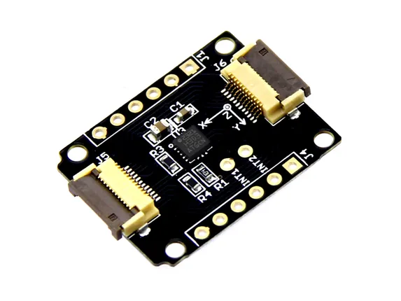

# Xadow - 3-Axis Digital Accelerometer (±400g)

**Seeed Studio** · Source collection

Revision: Unverified source identity  
Coverage: Source collection; review pending

[Browse all manufacturers](../../../../BROWSE.md) · [Desktop app](https://github.com/valleytechsolutions/black-wire-desktop)

## 3-Axis Digital Accelerometer (±400g) - Hardware Overview

**source reference** · Unreviewed source · JPG

[Open original reference](../../../../library/media/d6b1f42e1f41308aacc8d4bc0e1874842b5fda4fe7a072e67a53c8dfbb83a9ff.jpg)

**Credit and rights:** Source rights not yet established. Source/manufacturer: Seeed Studio.

[Source 1](https://files.seeedstudio.com/wiki/Xadow_3_Aixs_Digital_Accelerometer_plusandminus_400g/img/Xadow_3Axis_Accelerometer400g.jpg) · [Source 2](https://wiki.seeedstudio.com/Xadow_3_Aixs_Digital_Accelerometer_plusandminus_400g/)

Original source index: 3-Axis Digital Accelerometer (±400g) - Hardware Overview. This file is searchable but has not been promoted to a reviewed physical board pinout.

SHA-256: `d6b1f42e1f41308aacc8d4bc0e1874842b5fda4fe7a072e67a53c8dfbb83a9ff`

Pin assignments have not been independently electrically verified. Check board revision before wiring.
