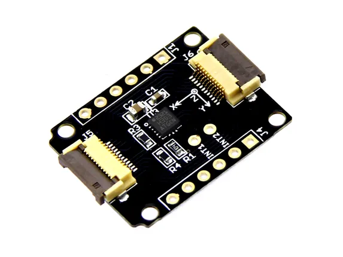

# Xadow - 3-Axis Digital Accelerometer (±400g)

**Seeed Studio** · Source collection

Revision: Unverified source identity

Coverage: Source collection; review pending

[Browse all manufacturers](../../../../BROWSE.md) · [Devices & IoT](../../../../DEVICES.md) · [Open in the browser guide](https://valleytech-black-wire-guide.pages.dev/?board=source-board-760407a57add0c79b9)

## Datasheets and original documentation

Board datasheet: **not yet recorded**. Visual reference: **available**.

[Manufacturer source (recorded link)](https://wiki.seeedstudio.com/Xadow_3_Aixs_Digital_Accelerometer_plusandminus_400g/)

A chip datasheet, schematic and board datasheet have different scopes. Match the exact hardware revision.

[Documentation coverage and remaining gaps](../../../../DOCUMENTATION.md)

## 3-Axis Digital Accelerometer (±400g) - Hardware Overview

**source reference** · Unreviewed source · JPG

[Open original reference](../../../../library/media/d6b1f42e1f41308aacc8d4bc0e1874842b5fda4fe7a072e67a53c8dfbb83a9ff.jpg)

**Credit and rights:** Source rights not yet established. Source/manufacturer: Seeed Studio.

[Source 1](https://files.seeedstudio.com/wiki/Xadow_3_Aixs_Digital_Accelerometer_plusandminus_400g/img/Xadow_3Axis_Accelerometer400g.jpg) · [Source 2](https://wiki.seeedstudio.com/Xadow_3_Aixs_Digital_Accelerometer_plusandminus_400g/)

Original source index: 3-Axis Digital Accelerometer (±400g) - Hardware Overview. This file is searchable but has not been promoted to a reviewed physical board pinout.

Image revision: Not identified

SHA-256: `d6b1f42e1f41308aacc8d4bc0e1874842b5fda4fe7a072e67a53c8dfbb83a9ff`

Pin assignments have not been independently electrically verified. Check board revision before wiring.
