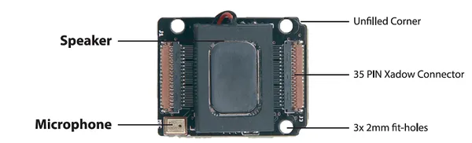

# Xadow - Audio

**Seeed Studio** · Source collection

Revision: Unverified source identity  
Coverage: Source collection; review pending

[Browse all manufacturers](../../../../BROWSE.md) · [Desktop app](https://github.com/valleytechsolutions/black-wire-desktop)

## Audio - Hardware Overview

**source reference** · Unreviewed source · PNG

[Open original reference](../../../../library/media/ef23f40ce6a21f54e74c32cb1f7289061dbc78568d3007d838bcab8c36de206f.png)

**Credit and rights:** Source rights not yet established. Source/manufacturer: Seeed Studio.

[Source 1](https://files.seeedstudio.com/wiki/Xadow_Audio/images/Xadow_Audio.png) · [Source 2](https://wiki.seeedstudio.com/Xadow_Audio/)

Original source index: Audio - Hardware Overview. This file is searchable but has not been promoted to a reviewed physical board pinout.

SHA-256: `ef23f40ce6a21f54e74c32cb1f7289061dbc78568d3007d838bcab8c36de206f`

Pin assignments have not been independently electrically verified. Check board revision before wiring.
