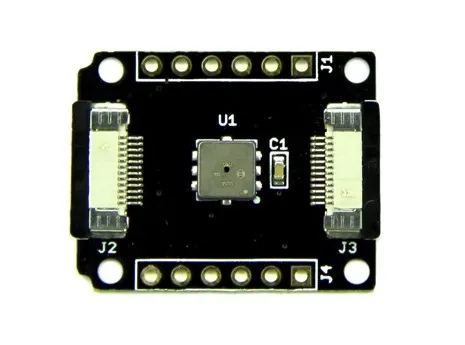

# Xadow - Barometer

**Seeed Studio** · Source collection

Revision: Unverified source identity  
Coverage: Source collection; review pending

[Browse all manufacturers](../../../../BROWSE.md) · [Desktop app](https://github.com/valleytechsolutions/black-wire-desktop)

## Barometer - Hardware Overview

**source reference** · Unreviewed source · JPG

[Open original reference](../../../../library/media/6e04a4bf8ac721934024a272d87b37ec4c207993c69b0ad2ab9067917f5bb698.jpg)

**Credit and rights:** Source rights not yet established. Source/manufacturer: Seeed Studio.

[Source 1](https://files.seeedstudio.com/wiki/Xadow_Barometer/img/Baro_Meter_01.jpg) · [Source 2](https://wiki.seeedstudio.com/Xadow_Barometer/)

Original source index: Barometer - Hardware Overview. This file is searchable but has not been promoted to a reviewed physical board pinout.

SHA-256: `6e04a4bf8ac721934024a272d87b37ec4c207993c69b0ad2ab9067917f5bb698`

Pin assignments have not been independently electrically verified. Check board revision before wiring.
