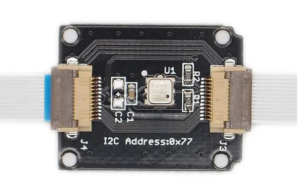

# Xadow - Barometer BMP180

**Seeed Studio** · Source collection

Revision: Unverified source identity  
Coverage: Source collection; review pending

[Browse all manufacturers](../../../../BROWSE.md) · [Desktop app](https://github.com/valleytechsolutions/black-wire-desktop)

## Barometer BMP180 - Hardware Overview

**source reference** · Unreviewed source · JPG

[Open original reference](../../../../library/media/d95b0e683a3cabfd128d34a1443d99db0e5739397f7ba04c5fd073e0727dc322.jpg)

**Credit and rights:** Source rights not yet established. Source/manufacturer: Seeed Studio.

[Source 1](https://files.seeedstudio.com/wiki/Xadow_Barometer_BMP180/img/Xadow-bmp180.JPG) · [Source 2](https://wiki.seeedstudio.com/Xadow_Barometer_BMP180/)

Original source index: Barometer BMP180 - Hardware Overview. This file is searchable but has not been promoted to a reviewed physical board pinout.

SHA-256: `d95b0e683a3cabfd128d34a1443d99db0e5739397f7ba04c5fd073e0727dc322`

Pin assignments have not been independently electrically verified. Check board revision before wiring.
