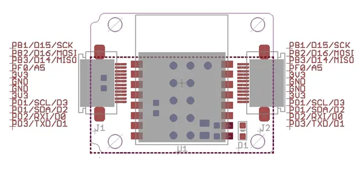

# Xadow - BLE

**Seeed Studio** · Source collection

Revision: Unverified source identity  
Coverage: Source collection; review pending

[Browse all manufacturers](../../../../BROWSE.md) · [Desktop app](https://github.com/valleytechsolutions/black-wire-desktop)

## BLE - Pinout

**source reference** · Unreviewed source · JPG

[Open original reference](../../../../library/media/808518dfd9ac90475dca7ba981fc668742c1c4d6fd8f8c198aa5ef7100d2b14d.jpg)

**Credit and rights:** Source rights not yet established. Source/manufacturer: Seeed Studio.

[Source 1](https://files.seeedstudio.com/wiki/Xadow_BLE/img/Xadow_ble_pin.jpg) · [Source 2](https://wiki.seeedstudio.com/Xadow_BLE/)

Original source index: BLE - Pinout. This file is searchable but has not been promoted to a reviewed physical board pinout.

SHA-256: `808518dfd9ac90475dca7ba981fc668742c1c4d6fd8f8c198aa5ef7100d2b14d`

Pin assignments have not been independently electrically verified. Check board revision before wiring.
