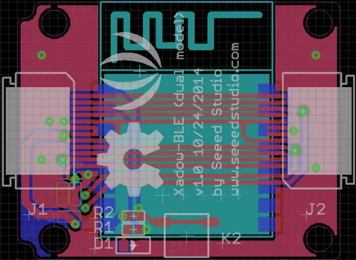

# Xadow - BLE (Dual Model) V1.0

**Seeed Studio** · Source collection

Revision: Unverified source identity  
Coverage: Source collection; review pending

[Browse all manufacturers](../../../../BROWSE.md) · [Desktop app](https://github.com/valleytechsolutions/black-wire-desktop)

## BLE (Dual Model) V1.0 - Hardware Overview

**source reference** · Unreviewed source · PNG

[Open original reference](../../../../library/media/173725c077844283697898e948c871d4b88215918cf44936500d372974274cef.png)

**Credit and rights:** Source rights not yet established. Source/manufacturer: Seeed Studio.

[Source 1](https://files.seeedstudio.com/wiki/Xadow_BLE_Dual_Model_V1.0/img/600px-Xadow_-_BLE_(dual_model)_v1.0.png) · [Source 2](https://wiki.seeedstudio.com/Xadow_BLE_Dual_Model_V1.0/)

Original source index: BLE (Dual Model) V1.0 - Hardware Overview. This file is searchable but has not been promoted to a reviewed physical board pinout.

SHA-256: `173725c077844283697898e948c871d4b88215918cf44936500d372974274cef`

Pin assignments have not been independently electrically verified. Check board revision before wiring.
