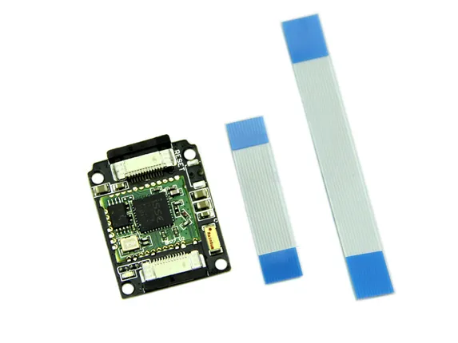

# Xadow - BLE Slave

**Seeed Studio** · Source collection

Revision: Unverified source identity  
Coverage: Source collection; review pending

[Browse all manufacturers](../../../../BROWSE.md) · [Desktop app](https://github.com/valleytechsolutions/black-wire-desktop)

## BLE Slave - Hardware Overview

**source reference** · Unreviewed source · JPG

[Open original reference](../../../../library/media/b099437bd47c95200360ee7a111169bc490f9914fa358164633da7c66c2fd124.jpg)

**Credit and rights:** Source rights not yet established. Source/manufacturer: Seeed Studio.

[Source 1](https://files.seeedstudio.com/wiki/Xadow_BLE_Slave/img/Xadow_ble_01.jpg) · [Source 2](https://wiki.seeedstudio.com/Xadow_BLE_Slave/)

Original source index: BLE Slave - Hardware Overview. This file is searchable but has not been promoted to a reviewed physical board pinout.

SHA-256: `b099437bd47c95200360ee7a111169bc490f9914fa358164633da7c66c2fd124`

Pin assignments have not been independently electrically verified. Check board revision before wiring.
