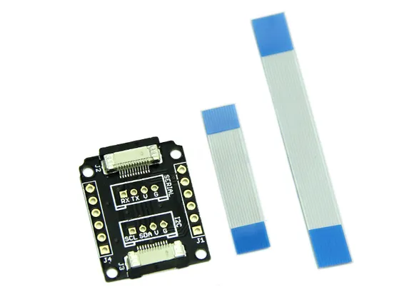

# Xadow - Breakout

**Seeed Studio** · Source collection

Revision: Unverified source identity  
Coverage: Source collection; review pending

[Browse all manufacturers](../../../../BROWSE.md) · [Desktop app](https://github.com/valleytechsolutions/black-wire-desktop)

## Breakout - Hardware Overview

**source reference** · Unreviewed source · JPG

[Open original reference](../../../../library/media/cd748ff404ff0f6724fd8735ee8d57ef1f7ab5f14fb9b3b24e198b46be8c6a1d.jpg)

**Credit and rights:** Source rights not yet established. Source/manufacturer: Seeed Studio.

[Source 1](https://files.seeedstudio.com/wiki/Xadow_Breakout/img/Xadow_Breakout_01.jpg) · [Source 2](https://wiki.seeedstudio.com/Xadow_Breakout/)

Original source index: Breakout - Hardware Overview. This file is searchable but has not been promoted to a reviewed physical board pinout.

SHA-256: `cd748ff404ff0f6724fd8735ee8d57ef1f7ab5f14fb9b3b24e198b46be8c6a1d`

Pin assignments have not been independently electrically verified. Check board revision before wiring.
