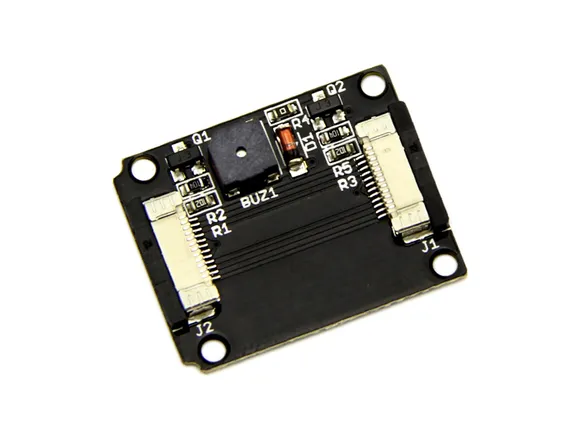

# Xadow - Buzzer

**Seeed Studio** · Source collection

Revision: Unverified source identity  
Coverage: Source collection; review pending

[Browse all manufacturers](../../../../BROWSE.md) · [Desktop app](https://github.com/valleytechsolutions/black-wire-desktop)

## Buzzer - Hardware Overview

**source reference** · Unreviewed source · JPG

[Open original reference](../../../../library/media/00b680c1a0acc1e7c5beb44dd20a946d0f1228b96f49f3e1defcfce6eadc6975.jpg)

**Credit and rights:** Source rights not yet established. Source/manufacturer: Seeed Studio.

[Source 1](https://files.seeedstudio.com/wiki/Xadow_Buzzer/img/Xadow_buzzer.jpg) · [Source 2](https://wiki.seeedstudio.com/Xadow_Buzzer/)

Original source index: Buzzer - Hardware Overview. This file is searchable but has not been promoted to a reviewed physical board pinout.

SHA-256: `00b680c1a0acc1e7c5beb44dd20a946d0f1228b96f49f3e1defcfce6eadc6975`

Pin assignments have not been independently electrically verified. Check board revision before wiring.
