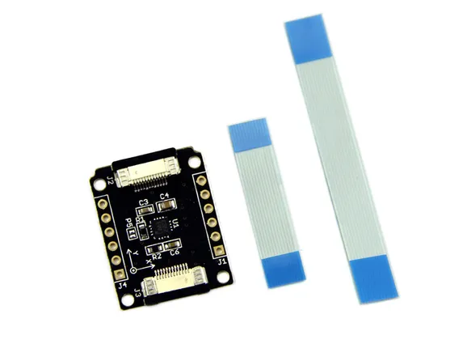

# Xadow - Compass

**Seeed Studio** · Source collection

Revision: Unverified source identity  
Coverage: Source collection; review pending

[Browse all manufacturers](../../../../BROWSE.md) · [Desktop app](https://github.com/valleytechsolutions/black-wire-desktop)

## Compass - Hardware Overview

**source reference** · Unreviewed source · JPG

[Open original reference](../../../../library/media/c2a355c78fbdc71a9fbcac460aee9adfdd215c79034edfe73dbb6237923e4fc1.jpg)

**Credit and rights:** Source rights not yet established. Source/manufacturer: Seeed Studio.

[Source 1](https://files.seeedstudio.com/wiki/Xadow_Compass/img/X_compass_01.jpg) · [Source 2](https://wiki.seeedstudio.com/Xadow_Compass/)

Original source index: Compass - Hardware Overview. This file is searchable but has not been promoted to a reviewed physical board pinout.

SHA-256: `c2a355c78fbdc71a9fbcac460aee9adfdd215c79034edfe73dbb6237923e4fc1`

Pin assignments have not been independently electrically verified. Check board revision before wiring.
