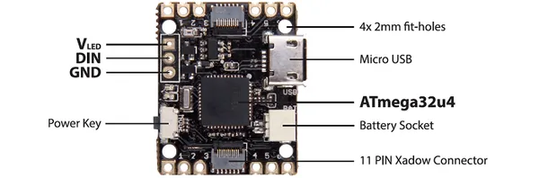
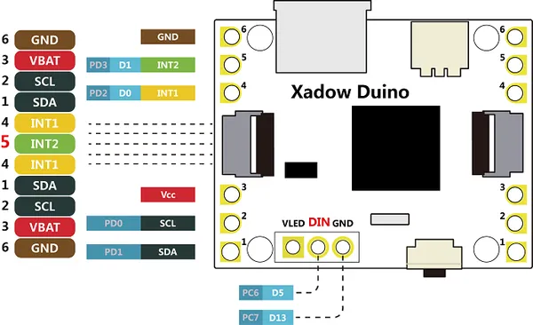

# Xadow - Duino

**Seeed Studio** · Source collection

Revision: Unverified source identity  
Coverage: Source collection; review pending

[Browse all manufacturers](../../../../BROWSE.md) · [Desktop app](https://github.com/valleytechsolutions/black-wire-desktop)

## Duino - Hardware Overview

**source reference** · Unreviewed source · PNG

[Open original reference](../../../../library/media/78ee0e95c1c32c520b107c67e9fe76081416b1af0edffdb20de9d95eb0a9dc87.png)

**Credit and rights:** Source rights not yet established. Source/manufacturer: Seeed Studio.

[Source 1](https://files.seeedstudio.com/wiki/Xadow-Duino/images/Xadow_Duino.png) · [Source 2](https://wiki.seeedstudio.com/Xadow_Duino/)

Original source index: Duino - Hardware Overview. This file is searchable but has not been promoted to a reviewed physical board pinout.

SHA-256: `78ee0e95c1c32c520b107c67e9fe76081416b1af0edffdb20de9d95eb0a9dc87`

## Duino - Pinout

**source reference** · Unreviewed source · PNG

[Open original reference](../../../../library/media/100d5561108a420445be914e65b967a99585db342f4479bbb056d1e0a85d917b.png)

**Credit and rights:** Source rights not yet established. Source/manufacturer: Seeed Studio.

[Source 1](https://files.seeedstudio.com/wiki/Xadow-Duino/images/Xadow_Duino_Pin_definitions.png) · [Source 2](https://wiki.seeedstudio.com/Xadow_Duino/)

Original source index: Duino - Pinout. This file is searchable but has not been promoted to a reviewed physical board pinout.

SHA-256: `100d5561108a420445be914e65b967a99585db342f4479bbb056d1e0a85d917b`

Pin assignments have not been independently electrically verified. Check board revision before wiring.
