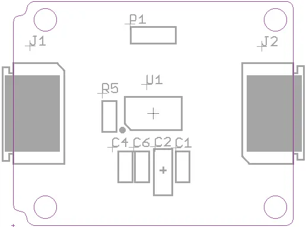
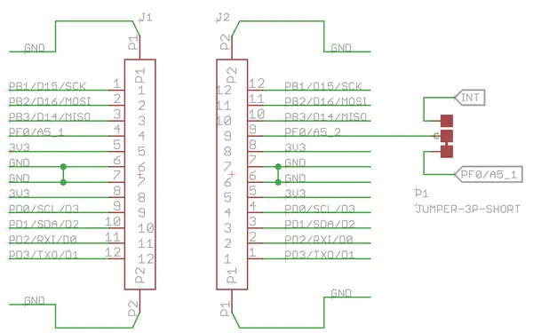

# Xadow - Gesture V1.0

**Seeed Studio** · Source collection

Revision: Unverified source identity  
Coverage: Source collection; review pending

[Browse all manufacturers](../../../../BROWSE.md) · [Desktop app](https://github.com/valleytechsolutions/black-wire-desktop)

## Gesture V1.0 - Hardware Overview

**source reference** · Unreviewed source · JPG

[Open original reference](../../../../library/media/e1fca4ca31385c811bb244fa52e1bac742f1ec963d8c865a551ea4b61dc90767.jpg)

**Credit and rights:** Source rights not yet established. Source/manufacturer: Seeed Studio.

[Source 1](https://files.seeedstudio.com/wiki/Xadow_Gesture_v1.0/img/Xadow_-_Gesture_2.jpg) · [Source 2](https://wiki.seeedstudio.com/Xadow_Gesture_v1.0/)

Original source index: Gesture V1.0 - Hardware Overview. This file is searchable but has not been promoted to a reviewed physical board pinout.

SHA-256: `e1fca4ca31385c811bb244fa52e1bac742f1ec963d8c865a551ea4b61dc90767`

## Gesture V1.0 - Pinout

**source reference** · Unreviewed source · JPG

[Open original reference](../../../../library/media/617d04cf3028469c8a2497b73a30c127bd26c6073967d16da46b186359f5bb20.jpg)

**Credit and rights:** Source rights not yet established. Source/manufacturer: Seeed Studio.

[Source 1](https://files.seeedstudio.com/wiki/Xadow_Gesture_v1.0/img/Xadow_-_Gesture_5.jpg) · [Source 2](https://wiki.seeedstudio.com/Xadow_Gesture_v1.0/)

Original source index: Gesture V1.0 - Pinout. This file is searchable but has not been promoted to a reviewed physical board pinout.

SHA-256: `617d04cf3028469c8a2497b73a30c127bd26c6073967d16da46b186359f5bb20`

Pin assignments have not been independently electrically verified. Check board revision before wiring.
