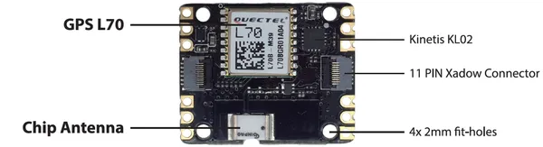

# Xadow - GPS V2

**Seeed Studio** · Source collection

Revision: Unverified source identity  
Coverage: Source collection; review pending

[Browse all manufacturers](../../../../BROWSE.md) · [Desktop app](https://github.com/valleytechsolutions/black-wire-desktop)

## GPS V2 - Hardware Overview

**source reference** · Unreviewed source · PNG

[Open original reference](../../../../library/media/82ef492742b2d1eef5a62140e95f87096122ed6478cf01599ce4840e9ef6b5b1.png)

**Credit and rights:** Source rights not yet established. Source/manufacturer: Seeed Studio.

Original source index: GPS V2 - Hardware Overview. This file is searchable but has not been promoted to a reviewed physical board pinout.

SHA-256: `82ef492742b2d1eef5a62140e95f87096122ed6478cf01599ce4840e9ef6b5b1`

Pin assignments have not been independently electrically verified. Check board revision before wiring.
