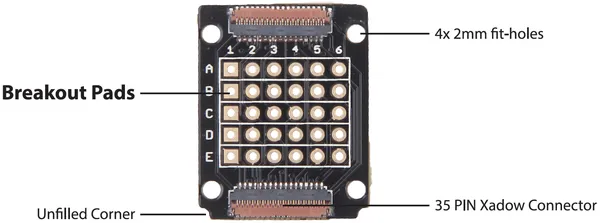
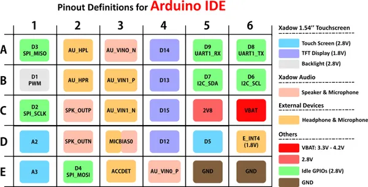
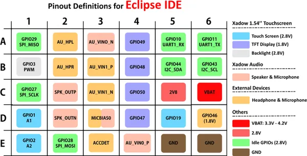

# Xadow - GSM Breakout

**Seeed Studio** · Source collection

Revision: Unverified source identity  
Coverage: Source collection; review pending

[Browse all manufacturers](../../../../BROWSE.md) · [Desktop app](https://github.com/valleytechsolutions/black-wire-desktop)

## GSM Breakout - Hardware Overview

**source reference** · Unreviewed source · PNG

[Open original reference](../../../../library/media/2a525e4a14f0a4193e7963f39836d189e82daa5fc299227f290ef93634aba9bd.png)

**Credit and rights:** Source rights not yet established. Source/manufacturer: Seeed Studio.

Original source index: GSM Breakout - Hardware Overview. This file is searchable but has not been promoted to a reviewed physical board pinout.

SHA-256: `2a525e4a14f0a4193e7963f39836d189e82daa5fc299227f290ef93634aba9bd`

## GSM Breakout - Pin Definition Table (Arduino IDE)

**source reference** · Unreviewed source · PNG

[Open original reference](../../../../library/media/1393dc5be98111546c354b5ba041ddeb135defae56501a13f003575fd71a4edf.png)

**Credit and rights:** Source rights not yet established. Source/manufacturer: Seeed Studio.

Original source index: GSM Breakout - Pin Definition Table (Arduino IDE). This file is searchable but has not been promoted to a reviewed physical board pinout.

SHA-256: `1393dc5be98111546c354b5ba041ddeb135defae56501a13f003575fd71a4edf`

## GSM Breakout - Pin Definition Table (Eclipse IDE)

**source reference** · Unreviewed source · PNG

[Open original reference](../../../../library/media/75fc9a598d15bbd4a57eb1e26876192ba91be6f91129705164e2586cd3c78fdd.png)

**Credit and rights:** Source rights not yet established. Source/manufacturer: Seeed Studio.

Original source index: GSM Breakout - Pin Definition Table (Eclipse IDE). This file is searchable but has not been promoted to a reviewed physical board pinout.

SHA-256: `75fc9a598d15bbd4a57eb1e26876192ba91be6f91129705164e2586cd3c78fdd`

Pin assignments have not been independently electrically verified. Check board revision before wiring.
