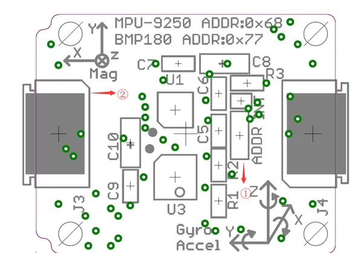

# Xadow - IMU 10DOF

**Seeed Studio** · Source collection

Revision: Unverified source identity  
Coverage: Source collection; review pending

[Browse all manufacturers](../../../../BROWSE.md) · [Desktop app](https://github.com/valleytechsolutions/black-wire-desktop)

## IMU 10DOF - Interfaces

**source reference** · Unreviewed source · PNG

[Open original reference](../../../../library/media/4eda98a9a5a076811dcbf6b31f6f88f690dd8f4b1eef05d09306702db83a24ee.png)

**Credit and rights:** Source rights not yet established. Source/manufacturer: Seeed Studio.

[Source 1](https://files.seeedstudio.com/wiki/Xadow_IMU_10DOF/img/Xadow-IMU_10DOF_Interface.png) · [Source 2](https://wiki.seeedstudio.com/Xadow_IMU_10DOF/)

Original source index: IMU 10DOF - Interfaces. This file is searchable but has not been promoted to a reviewed physical board pinout.

SHA-256: `4eda98a9a5a076811dcbf6b31f6f88f690dd8f4b1eef05d09306702db83a24ee`

Pin assignments have not been independently electrically verified. Check board revision before wiring.
