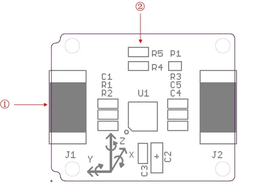

# Xadow - IMU 9DOF

**Seeed Studio** · Source collection

Revision: Unverified source identity  
Coverage: Source collection; review pending

[Browse all manufacturers](../../../../BROWSE.md) · [Desktop app](https://github.com/valleytechsolutions/black-wire-desktop)

## IMU 9DOF - Interfaces

**source reference** · Unreviewed source · JPG

[Open original reference](../../../../library/media/8e7bab2a2d94df5fa55be6ae7a7c20909d4cf3357fb5d1ce1a8da5906ebcf103.jpg)

**Credit and rights:** Source rights not yet established. Source/manufacturer: Seeed Studio.

[Source 1](https://files.seeedstudio.com/wiki/Xadow_IMU_9DOF/img/Xadow_-_IMU_9DOF.jpg) · [Source 2](https://wiki.seeedstudio.com/Xadow_IMU_9DOF/)

Original source index: IMU 9DOF - Interfaces. This file is searchable but has not been promoted to a reviewed physical board pinout.

SHA-256: `8e7bab2a2d94df5fa55be6ae7a7c20909d4cf3357fb5d1ce1a8da5906ebcf103`

Pin assignments have not been independently electrically verified. Check board revision before wiring.
