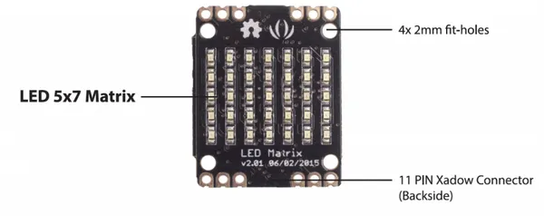

# Xadow - LED 5x7

**Seeed Studio** · Source collection

Revision: Unverified source identity  
Coverage: Source collection; review pending

[Browse all manufacturers](../../../../BROWSE.md) · [Desktop app](https://github.com/valleytechsolutions/black-wire-desktop)

## LED 5x7 - Hardware Overview

**source reference** · Unreviewed source · PNG

[Open original reference](../../../../library/media/230c742f23ea0f14194c971a0738b61320d71486ad3054a9aaf09ab7859a05bd.png)

**Credit and rights:** Source rights not yet established. Source/manufacturer: Seeed Studio.

[Source 1](https://files.seeedstudio.com/wiki/Xadow_LED_5x7/images/800px-Xadow_LED_5x7.png) · [Source 2](https://wiki.seeedstudio.com/Xadow_LED_5x7/)

Original source index: LED 5x7 - Hardware Overview. This file is searchable but has not been promoted to a reviewed physical board pinout.

SHA-256: `230c742f23ea0f14194c971a0738b61320d71486ad3054a9aaf09ab7859a05bd`

Pin assignments have not been independently electrically verified. Check board revision before wiring.
