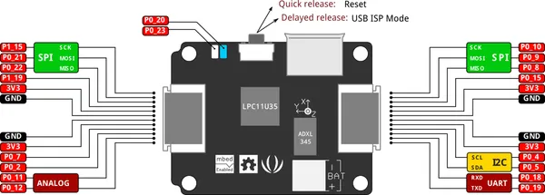

# Xadow - M0

**Seeed Studio** · Source collection

Revision: Unverified source identity  
Coverage: Source collection; review pending

[Browse all manufacturers](../../../../BROWSE.md) · [Desktop app](https://github.com/valleytechsolutions/black-wire-desktop)

## M0 - Pinout

**source reference** · Unreviewed source · PNG

[Open original reference](../../../../library/media/2b2f89cbf35dba34502f170f43db4a1d6d7e5e858900c325cb81d27c7144daba.png)

**Credit and rights:** Source rights not yet established. Source/manufacturer: Seeed Studio.

[Source 1](https://files.seeedstudio.com/wiki/Xadow_M0/img/Xadow_M0_Pinout.png) · [Source 2](https://wiki.seeedstudio.com/Xadow_M0/)

Original source index: M0 - Pinout. This file is searchable but has not been promoted to a reviewed physical board pinout.

SHA-256: `2b2f89cbf35dba34502f170f43db4a1d6d7e5e858900c325cb81d27c7144daba`

Pin assignments have not been independently electrically verified. Check board revision before wiring.
