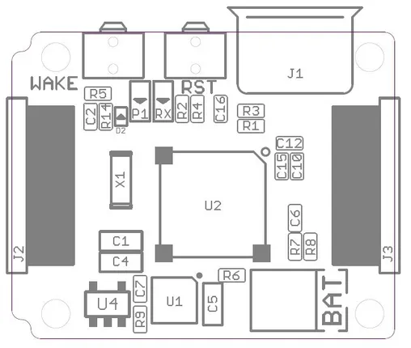
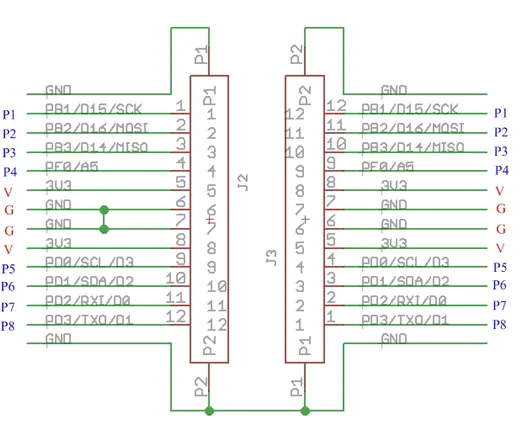

# Xadow - Main Board

**Seeed Studio** · Source collection

Revision: Unverified source identity

Coverage: Source collection; review pending

[Browse all manufacturers](../../../../BROWSE.md) · [Devices & IoT](../../../../DEVICES.md) · [Open in the browser guide](https://valleytech-black-wire-guide.pages.dev/?board=source-board-43a2f3a40bbde6d48a)

## Datasheets and original documentation

Board datasheet: **not yet recorded**. Visual reference: **available**.

[Manufacturer source (recorded link)](https://wiki.seeedstudio.com/Xadow_Main_Board/)

A chip datasheet, schematic and board datasheet have different scopes. Match the exact hardware revision.

[Documentation coverage and remaining gaps](../../../../DOCUMENTATION.md)

## Main Board - Interfaces

**source reference** · Unreviewed source · JPG

[Open original reference](../../../../library/media/5888ea309ca991878140feae8141f64e8045e6b5a609af04c4ea909be9fb6d8b.jpg)

**Credit and rights:** Source rights not yet established. Source/manufacturer: Seeed Studio.

[Source 1](https://files.seeedstudio.com/wiki/Xadow_Main_Board/img/XadowMainBoardScreen.jpg) · [Source 2](https://wiki.seeedstudio.com/Xadow_Main_Board/)

Original source index: Main Board - Interfaces. This file is searchable but has not been promoted to a reviewed physical board pinout.

Image revision: Not identified

SHA-256: `5888ea309ca991878140feae8141f64e8045e6b5a609af04c4ea909be9fb6d8b`

## Main Board - Pin Definition Table

**source reference** · Unreviewed source · JPG

[Open original reference](../../../../library/media/3b4cbd070dbba5e5d5393dffa67d2a45c2bc7f82c74cb79e7e432ee3e06374b9.jpg)

**Credit and rights:** Source rights not yet established. Source/manufacturer: Seeed Studio.

[Source 1](https://files.seeedstudio.com/wiki/Xadow_Main_Board/img/Xadow_Pins.jpg) · [Source 2](https://wiki.seeedstudio.com/Xadow_Main_Board/)

Original source index: Main Board - Pin Definition Table. This file is searchable but has not been promoted to a reviewed physical board pinout.

Image revision: Not identified

SHA-256: `3b4cbd070dbba5e5d5393dffa67d2a45c2bc7f82c74cb79e7e432ee3e06374b9`

Pin assignments have not been independently electrically verified. Check board revision before wiring.
