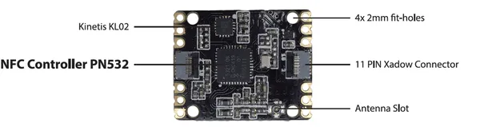

# Xadow - NFC V2

**Seeed Studio** · Source collection

Revision: Unverified source identity  
Coverage: Source collection; review pending

[Browse all manufacturers](../../../../BROWSE.md) · [Desktop app](https://github.com/valleytechsolutions/black-wire-desktop)

## NFC V2 - Hardware Overview

**source reference** · Unreviewed source · PNG

[Open original reference](../../../../library/media/284d2936eafcc4d5fc5d7e1a85bf2112963efd0e5c68b3187105930d0732247d.png)

**Credit and rights:** Source rights not yet established. Source/manufacturer: Seeed Studio.

[Source 1](https://seeeddoc.github.io/Xadow_NFC_v2/img/Xadow_NFC_v2.png) · [Source 2](https://wiki.seeedstudio.com/Xadow_NFC_v2/)

Original source index: NFC V2 - Hardware Overview. This file is searchable but has not been promoted to a reviewed physical board pinout.

SHA-256: `284d2936eafcc4d5fc5d7e1a85bf2112963efd0e5c68b3187105930d0732247d`

Pin assignments have not been independently electrically verified. Check board revision before wiring.
