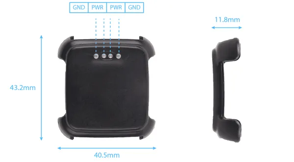
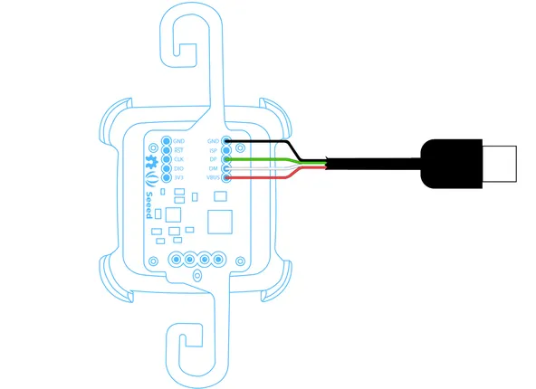

# Xadow - Pebble Time Adapter

**Seeed Studio** · Source collection

Revision: Unverified source identity  
Coverage: Source collection; review pending

[Browse all manufacturers](../../../../BROWSE.md) · [Desktop app](https://github.com/valleytechsolutions/black-wire-desktop)

## Pebble Time Adapter - Dimensions

**source reference** · Unreviewed source · PNG

[Open original reference](../../../../library/media/baeba08d7d4ca289330395aaea4907770e13aca54a78c70560039eb6cab24505.png)

**Credit and rights:** Source rights not yet established. Source/manufacturer: Seeed Studio.

[Source 1](https://files.seeedstudio.com/wiki/Xadow_Pebble_Time_Adapter/img/Pebble_base_2.png) · [Source 2](https://wiki.seeedstudio.com/Xadow_Pebble_Time_Adapter/)

Original source index: Pebble Time Adapter - Dimensions. This file is searchable but has not been promoted to a reviewed physical board pinout.

SHA-256: `baeba08d7d4ca289330395aaea4907770e13aca54a78c70560039eb6cab24505`

## Pebble Time Adapter - Pinout

**source reference** · Unreviewed source · PNG

[Open original reference](../../../../library/media/dd4633ed7bd425952483034a03b88c1d9cc0f5cec12e5b7d70edde1184922157.png)

**Credit and rights:** Source rights not yet established. Source/manufacturer: Seeed Studio.

[Source 1](https://files.seeedstudio.com/wiki/Xadow_Pebble_Time_Adapter/img/Hack_USB_cable-03.png) · [Source 2](https://wiki.seeedstudio.com/Xadow_Pebble_Time_Adapter/)

Original source index: Pebble Time Adapter - Pinout. This file is searchable but has not been promoted to a reviewed physical board pinout.

SHA-256: `dd4633ed7bd425952483034a03b88c1d9cc0f5cec12e5b7d70edde1184922157`

Pin assignments have not been independently electrically verified. Check board revision before wiring.
