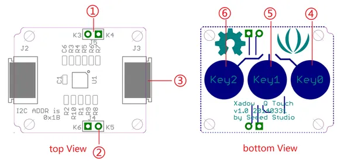

# Xadow - Q Touch Sensor

**Seeed Studio** · Source collection

Revision: Unverified source identity

Coverage: Source collection; review pending

[Browse all manufacturers](../../../../BROWSE.md) · [Devices & IoT](../../../../DEVICES.md) · [Open in the browser guide](https://valleytech-black-wire-guide.pages.dev/?board=source-board-3ed41ac2f7590b1856)

## Datasheets and original documentation

Board datasheet: **not yet recorded**. Visual reference: **available**.

[Manufacturer source (recorded link)](https://wiki.seeedstudio.com/Xadow_Q_Touch_Sensor/)

A chip datasheet, schematic and board datasheet have different scopes. Match the exact hardware revision.

[Documentation coverage and remaining gaps](../../../../DOCUMENTATION.md)

## Q Touch Sensor - Interfaces

**source reference** · Unreviewed source · PNG

[Open original reference](../../../../library/media/dc9bf600cce0416fa45e8b55cbecda146ecfe134599c492eba38801d87587d2d.png)

**Credit and rights:** Source rights not yet established. Source/manufacturer: Seeed Studio.

[Source 1](https://files.seeedstudio.com/wiki/Xadow_Q_Touch_Sensor/img/Xadow-Q_Touch.png) · [Source 2](https://wiki.seeedstudio.com/Xadow_Q_Touch_Sensor/)

Original source index: Q Touch Sensor - Interfaces. This file is searchable but has not been promoted to a reviewed physical board pinout.

Image revision: Not identified

SHA-256: `dc9bf600cce0416fa45e8b55cbecda146ecfe134599c492eba38801d87587d2d`

Pin assignments have not been independently electrically verified. Check board revision before wiring.
