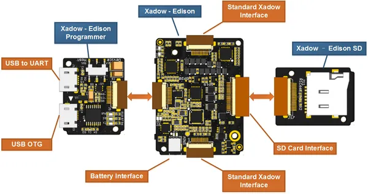

# Xadow Wearable Kit for Edison

**Seeed Studio** · Source collection

Revision: Unverified source identity  
Coverage: Source collection; review pending

[Browse all manufacturers](../../../../BROWSE.md) · [Desktop app](https://github.com/valleytechsolutions/black-wire-desktop)

## Hardware Overview

**source reference** · Unreviewed source · PNG

[Open original reference](../../../../library/media/e47bd47128d4e8435ade05240b95904d11fd0c4c9814b973f57f442be2e77745.png)

**Credit and rights:** Source rights not yet established. Source/manufacturer: Seeed Studio.

[Source 1](https://files.seeedstudio.com/wiki/Xadow_Edison_Kit/img/Xadow-Edison_Connection.png) · [Source 2](https://wiki.seeedstudio.com/Xadow_Edison_Kit/)

Original source index: Hardware Overview. This file is searchable but has not been promoted to a reviewed physical board pinout.

SHA-256: `e47bd47128d4e8435ade05240b95904d11fd0c4c9814b973f57f442be2e77745`

Pin assignments have not been independently electrically verified. Check board revision before wiring.
