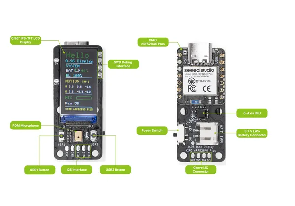

# XIAO 0.96inch IPS Display (nRF52840)

**Seeed Studio** · Source collection

Revision: Unverified source identity  
Coverage: Source collection; review pending

[Browse all manufacturers](../../../../BROWSE.md) · [Desktop app](https://github.com/valleytechsolutions/black-wire-desktop)

## Hardware Overview

**source reference** · Unreviewed source · PNG

[Open original reference](../../../../library/media/fe1fa7495db8d69cb88119fc7ce9cd0170058564f76ea9b57509b44e8b0ed06f.png)

**Credit and rights:** Source rights not yet established. Source/manufacturer: Seeed Studio.

[Source 1](https://files.seeedstudio.com/wiki/Display_Gadgets/imgs/096_nRF52840Plus_display_hardware_overview.png) · [Source 2](https://wiki.seeedstudio.com/getting_started_0.96_inch_display_nrf52840/)

Original source index: Hardware Overview. This file is searchable but has not been promoted to a reviewed physical board pinout.

SHA-256: `fe1fa7495db8d69cb88119fc7ce9cd0170058564f76ea9b57509b44e8b0ed06f`

Pin assignments have not been independently electrically verified. Check board revision before wiring.
