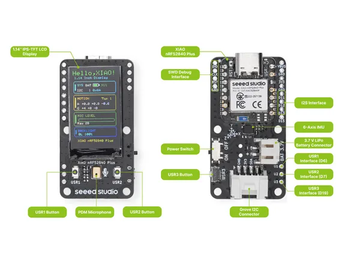

# XIAO 1.14inch IPS Display (nRF52840)

**Seeed Studio** · Source collection

Revision: Unverified source identity  
Coverage: Source collection; review pending

[Browse all manufacturers](../../../../BROWSE.md) · [Desktop app](https://github.com/valleytechsolutions/black-wire-desktop)

## Hardware Overview

**source reference** · Unreviewed source · PNG

[Open original reference](../../../../library/media/e6bae06554efa2f156f89be85d1f579544d3a40ce0b2b8b06c75d3d39bf412b5.png)

**Credit and rights:** Source rights not yet established. Source/manufacturer: Seeed Studio.

[Source 1](https://files.seeedstudio.com/wiki/Display_Gadgets/imgs/114_nRF52840Plus_display_hardware_overview.png) · [Source 2](https://wiki.seeedstudio.com/getting_started_1.14_inch_display_nrf52840/)

Original source index: Hardware Overview. This file is searchable but has not been promoted to a reviewed physical board pinout.

SHA-256: `e6bae06554efa2f156f89be85d1f579544d3a40ce0b2b8b06c75d3d39bf412b5`

Pin assignments have not been independently electrically verified. Check board revision before wiring.
