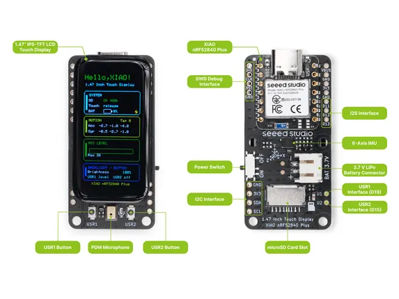

# XIAO 1.47inch IPS Touch Display (nRF52840)

**Seeed Studio** · Source collection

Revision: Unverified source identity  
Coverage: Source collection; review pending

[Browse all manufacturers](../../../../BROWSE.md) · [Desktop app](https://github.com/valleytechsolutions/black-wire-desktop)

## Hardware Overview

**source reference** · Unreviewed source · PNG

[Open original reference](../../../../library/media/6c0a098f3e28f1bec00fb61005e010dc41392b8be67dcf7a47248319579f1cd7.png)

**Credit and rights:** Source rights not yet established. Source/manufacturer: Seeed Studio.

[Source 1](https://files.seeedstudio.com/wiki/Display_Gadgets/imgs/147_nRF52840Plus_display_hardware_overview.png) · [Source 2](https://wiki.seeedstudio.com/getting_started_1.47_inch_touch_display_nrf52840/)

Original source index: Hardware Overview. This file is searchable but has not been promoted to a reviewed physical board pinout.

SHA-256: `6c0a098f3e28f1bec00fb61005e010dc41392b8be67dcf7a47248319579f1cd7`

Pin assignments have not been independently electrically verified. Check board revision before wiring.
