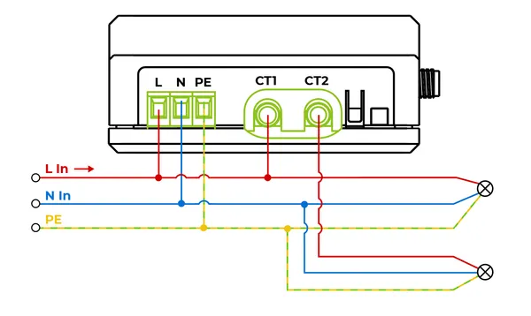

# XIAO 2-Channel Wi-Fi AC Energy Meter

**Seeed Studio** · Source collection

Revision: Unverified source identity  
Coverage: Source collection; review pending

[Browse all manufacturers](../../../../BROWSE.md) · [Desktop app](https://github.com/valleytechsolutions/black-wire-desktop)

## Interfaces

**source reference** · Unreviewed source · PNG

[Open original reference](../../../../library/media/1400d2129e7e3d9c5260c72781b3741368f4fae23a20063f29811f4bb254ae85.png)

**Credit and rights:** Source rights not yet established. Source/manufacturer: Seeed Studio.

[Source 1](https://files.seeedstudio.com/wiki/XIAO/Gadgets/2_channel_wifi_ac_energy_meter/energy_meter_wiring.png) · [Source 2](https://wiki.seeedstudio.com/2_channel_wifi_ac_energy_meter/)

Original source index: Interfaces. This file is searchable but has not been promoted to a reviewed physical board pinout.

SHA-256: `1400d2129e7e3d9c5260c72781b3741368f4fae23a20063f29811f4bb254ae85`

Pin assignments have not been independently electrically verified. Check board revision before wiring.
