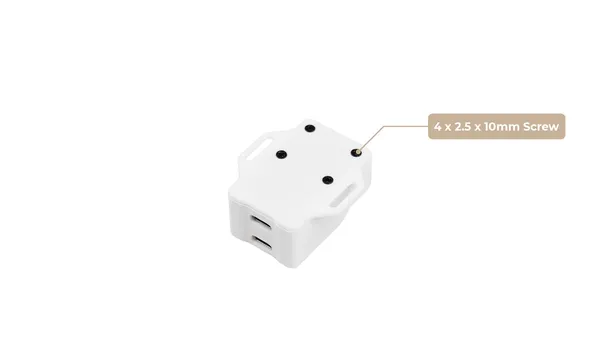

# XIAO Bus Servo Adapter

**Seeed Studio** · Source collection

Revision: Unverified source identity  
Coverage: Source collection; review pending

[Browse all manufacturers](../../../../BROWSE.md) · [Desktop app](https://github.com/valleytechsolutions/black-wire-desktop)

## Hardware Overview (Bottom)

**source reference** · Unreviewed source · PNG

[Open original reference](../../../../library/media/c19af59fa983ae2c6a6ceb936cc5a8bf86906025ab7dba151df09faf55775dc5.png)

**Credit and rights:** Source rights not yet established. Source/manufacturer: Seeed Studio.

[Source 1](https://files.seeedstudio.com/wiki/bus_servo_driver_board/4.png) · [Source 2](https://wiki.seeedstudio.com/xiao_bus_servo_adapter/)

Original source index: Hardware Overview (Bottom). This file is searchable but has not been promoted to a reviewed physical board pinout.

SHA-256: `c19af59fa983ae2c6a6ceb936cc5a8bf86906025ab7dba151df09faf55775dc5`

Pin assignments have not been independently electrically verified. Check board revision before wiring.
